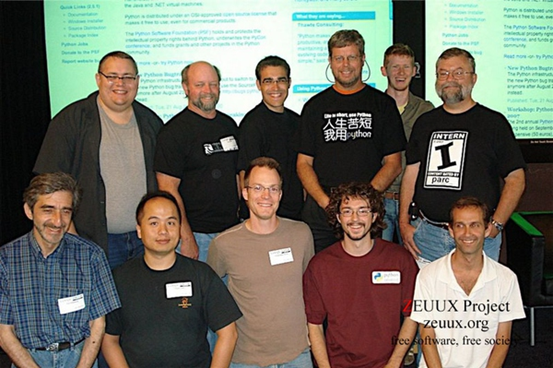
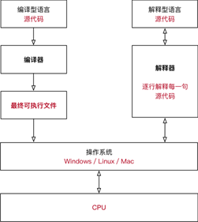
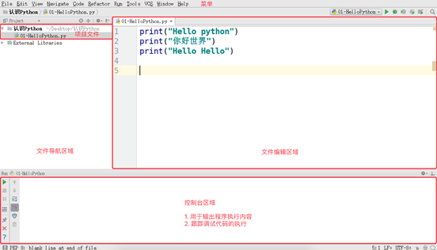
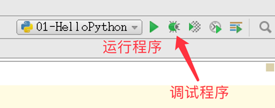
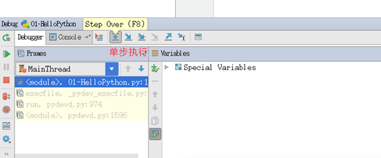
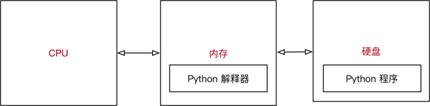
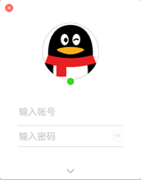
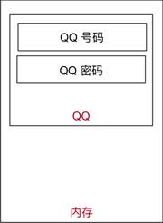

[](https://github.com/TheAlgorithms/Python/blob/master/CONTRIBUTING.md)

## 介绍

- 邮箱：

   gaofeng_zgf@163.com
   
   操作：
   
   首先，我们对每个文件的每个代码块都设置了标志位flag，如果你想运行某个代码块，将flag改为True即可。


- 编译：

  Markdown编辑器使用[Typora](https://typora.io/)

  主题使用[Drake](https://theme.typora.io/theme/Drake/)

  

- 其他链接：

  [菜鸟学习Java-从入门到跑路](https://github.com/Nicolas-gaofeng/Salute_Java)

  [菜鸟学习Git-从入门到跑路](https://github.com/Nicolas-gaofeng/Salute_Git)

  [菜鸟学习算法-从入门到跑路](https://github.com/Nicolas-gaofeng/Salute_Algorithm)

  [菜鸟学习机器学习-从入门到跑路](https://github.com/Nicolas-gaofeng/Salute_Machine_Learning)

  [菜鸟学习深度学习-从入门到跑路](https://github.com/Nicolas-gaofeng/Salute_Deep_Learning)

  [菜鸟学习知识图谱-从入门到跑路](https://github.com/Nicolas-gaofeng/Salute_Knowledge_Graph)

  [菜鸟学习数学-从入门到跑路](https://github.com/Nicolas-gaofeng/Salute_Math)

  

- 个人声明：

  这是一份学习python的菜鸟教程-从入门到跑路。

  如果本仓库存在的内容对您和您的利益产生损害，请立即私信我们，我们将在最短时间内对其做出删除处理。

  大家有问题，欢迎与我交流、分享，我期待你的来电！


- 鸣谢：

  如果文中出现错误，请与我联系。如果建议或提议十分不错，予以采纳，我将给予适当的物质奖励，并将你纳入贡献者名单！提出小错误或小的建议也是OK的哦，也会纳入名单的哦！期待你的来信！

## 目录

* [介绍](#介绍)
* [目录](#目录)
* [下载与安装](#下载与安装)

## 下载与安装

[Python](https://www.python.org/getit/)

## 一、Python概述

### 1.1 认识Python

人生苦短，我用 Python —— Life is short, you need Python



#### 1.1.1 Python的起源

Python 的创始人为吉多·范罗苏姆（Guido van Rossum）


1989 年的圣诞节期间，吉多·范罗苏姆为了在阿姆斯特丹打发时间，决心开发一个新的解释程序，作为 ABC 语言的一种继承（感觉下什么叫牛人）

ABC 是由吉多参加设计的一种教学语言，就吉多本人看来，ABC 这种语言非常优美和强大，是专门为非专业程序员设计的。但是ABC语言并没有成功，究其原因，吉多认为是非开放造成的。吉多决心在 Python 中避免这一错误，并获取了非常好的效果

之所以选中 Python（蟒蛇）作为程序的名字，是因为他是 BBC 电视剧——蒙提·派森的飞行马戏团（Monty Python's Flying Circus）的爱好者

1991 年，第一个 Python 解释器诞生，它是用 C 语言实现的，并能够调用 C 语言的库文件

#### 1.1.2 Python的设计目标

1999 年，吉多·范罗苏姆向 DARPA 提交了一条名为 “Computer Programming for Everybody” 的资金申请，并在后来说明了他对 Python 的目标：

- 一门简单直观的语言并与主要竞争者一样强大
- 开源，以便任何人都可以为它做贡献
- 代码像纯英语那样容易理解
- 适用于短期开发的日常任务

这些想法中的基本都已经成为现实，Python 已经成为一门流行的编程语言

#### 1.1.3 Python的设计哲学

- 优雅
- 明确
- 简单

Python 开发者的哲学是：用一种方法，最好是只有一种方法来做一件事

如果面临多种选择，Python 开发者一般会拒绝花俏的语法，而选择明确没有或者很少有歧义的语法

在 Python 社区，吉多被称为“仁慈的独裁者”

#### 1.1.4 为什么选择 Python？

- 代码量少
- ……

同一样问题，用不同的语言解决，代码量差距还是很多的，一般情况下 Python 是 Java 的 1/5，所以说 人生苦短，我用 Python

#### 1.1.5 Python特点

1. Python 是完全面向对象的语言

   函数、模块、数字、字符串都是对象

   在 Python 中一切皆对象完全支持继承、重载、多重继承支持重载运算符，也支持泛型设计 

2. Python 拥有一个强大的标准库

   Python 语言的核心只包含 数字、字符串、列表、字典、文件等常见类型和函数，而由 Python 标准库提供了 系统管理、网络通信、文本处理、数据库接口、图形系统、XML 处理等额外的功能

3. Python 社区提供了大量的第三方模块，使用方式与标准库类似。它们的功能覆盖 科学计算、人工智能、机器学习、Web 开发、数据库接口、图形系统 多个领域

4. 面向对象的思维方式

- 面向对象 是一种 思维方式，也是一门 程序设计技术

- 要解决一个问题前，首先考虑 由谁来做，怎么做事情是 谁 的职责，最后把事情做好就行！

- - 对象就是谁
  - 要解决复杂的问题，就可以找多个不同的对象，各司其职，共同实现，最终完成需求

`Python的优缺点`

- 优点
  - 简单、易学
  - 免费、开源
  - 面向对象
  - 丰富的库
  - 可扩展性

- - 如果需要一段关键代码运行得更快或者希望某些算法不公开，可以把这部分程序用 C 或 C++ 编写，然后在 Python 程序中使用它们
  - 

- 缺点
  - 运行速度
  - 国内市场较小
  - 中文资料匮乏

#### 1.1.6 编译器和解释器

计算机不能直接理解任何除机器语言以外的语言，所以必须要把程序员所写的程序语言翻译成机器语言，计算机才能执行程序。将其他语言翻译成机器语言的工具，被称为编译器

编译器翻译的方式有两种：一个是编译，另外一个是解释。两种方式之间的区别在于翻译时间点的不同。当编译器以解释方式运行的时候，也称之为解释器



- 编译型语言：

  程序在执行之前需要一个专门的编译过程，把程序编译成为机器语言的文件，运行时不需要重新翻译，直接使用编译的结果就行了。程序执行效率高，依赖编译器，跨平台性差些。如 C、C++，缺点不能跨平台，开发速度慢（将代码一次性全部转化成字节码）

- 解释型语言：

  解释型语言编写的程序不进行预先编译，以文本方式存储程序代码，会将代码一句一句直接运行。在发布程序时，看起来省了道编译工序，但是在运行程序的时候，必须先解释再运行

  优点：开发效率高，便于调试，可以跨平台

  缺点：执行速度相对低（代码从上至下逐行解释）

  Python解释器 Cpython，Jpython，Ironpython，pypy…


编译型语言和解释型语言对比

- 速度 —— 编译型语言比解释型语言执行速度快
- 跨平台性 —— 解释型语言比编译型语言跨平台性好

#### 1.1.7 编码

ASCII:最初版本的密码本：所有的英文字母，数字，特殊字符。

ASCII最左边为0，为当时设计师预留的一位，七位足可以表示英文+数字+特殊字符

最初：

一个字符0000001

后来优化

A:01000001 8位==1个字节

a:01100001

c:01100011

对于ASCII码来说：

'hello laddy' 11个字符，11个字节。

只能表示2**8=256个字符

unicode:万国码，将所有国家的语言文字都写入这个密码本

起初：1个字符16位2个字节表示。

A:01000001 01000001

b:01000001 01100001

中：01000001 01100101

只能表示2**16=65536个字符

改版：1个字符32位4个字节表示。

A:01000001 01000001 01000001 01000001

b:01000001 01100001 01000001 01000001

中：01000001 01100101 01000001 01000001

浪费空间，占资源

表示2**32= 个字符

Utf-8:最少用8位表示一个字符

A: 01000001一个字节

欧洲文字：01000001 01100001两个字节

中：01000001 01100101 01000001三个字节

'old男孩':9个字节

gbk：国标，只包含中文，英文（英文，数字，特殊字符）

A:01000001一个字节

中：0100000101100101两个字节

 

 

 

1,编码之间能不能互相识别。不能互相识别。

2,网络传输，或者硬盘存储的010101,必须是以非uniocde编码方式的01010101.

大环境python3x:

str:内存（内部）编码方式为Unicode。

bytes:python的基础数据类型，他和str相当于双胞胎。

int

tuple

list

dict

set

 

 

8 bit == 1bytes

1024bytes==kb

1024kb==1MB

1024MB==1GB

1024GB==1TB

1024TB==1PB

 

python中真正意义的代码块是什么？

\# 一个模块，一个函数，一个类，一个文件等都是一个代码块。

交互模式下，每一行是一个代码块。

\>>> i1 = 1000 可以理解为这一行在一个文件中。

\# >>> i2 = 1000 可以理解为这一行在另一个文件中。

#### 1.1.8 执行程序的三种方式

##### 1.1.8.1 解释器 `python` / `python3`

Python 的解释器

```
# 使用 python 2.x 解释器
$ python xxx.py
 
# 使用 python 3.x 解释器
$ python3 xxx.py
```

- - 为了不带入过多的累赘，Python 3.0 在设计的时候 没有考虑向下兼容
  - 许多早期 Python 版本设计的程序都无法在 Python 3.0 上正常执行

**python2x与python3x区别**

- python2x:

  源码重复，不规范；默认编码ASCII，不支持中文，如果想显示中文，需在首行添加 # -*-encoding：utf-8 -*-。

- python3x:

  源码规范，优美，清晰，简单；默认编码utf-8。

**其他解释器**

Python的解释器 如今有多个语言的实现，包括：

- `CPython` —— 官方版本的 C 语言实现
- `Jython` —— 可以运行在 Java 平台
- `IronPython` —— 可以运行在 .NET 和 Mono 平台
- `PyPy` —— Python 实现的，支持 JIT 即时编译

##### 1.1.8.2  交互式运行 Python 程序

直接在终端中运行解释器，而不输入要执行的文件名

1) `Python Shell`

- 在 Python 的 `Shell` 中直接输入 Python 的代码，会立即看到程序执行结果

a.交互式运行 Python 的优缺点

​	优点

​		适合于学习/验证 Python 语法或者局部代码

​	缺点

​		代码不能保存

​		不适合运行太大的程序

b.退出 官方的解释器

- 直接输入 `exit()`

```
>>> exit()
```

- 使用热键退出

在 python 解释器中，按热键 `ctrl + d` 可以退出解释器

`2. IPython`

- IPython 中 的 “I” 代表 交互 **interactive**

a.特点

- IPython 是一个 python 的 交互式 shell，比默认的 `python shell` 好用得多

  ​	支持自动补全

  ​	自动缩进

  ​	支持 `bash shell` 命令

  ​	内置了许多很有用的功能和函数

- IPython 是基于 BSD 开源的

b.版本

​	Python 2.x 使用的解释器是 **ipython**

​	Python 3.x 使用的解释器是 **ipython3**

c.要退出解释器可以有以下两种方式：

1> 直接输入 `exit`

```
In [1]: exit
```

2> 使用热键退出

在 IPython 解释器中，按热键 `ctrl + d`，`IPython` 会询问是否退出解释器

- IPython 的安装

```
$ sudo apt install ipython
```

##### 1.1.8.3 Python 的 IDE —— `PyCharm`

1） 集成开发环境（IDE）

集成开发环境（`IDE`，Integrated Development Environment）—— 集成了开发软件需要的所有工具，一般包括以下工具：

- 图形用户界面
- 代码编辑器（支持 代码补全／自动缩进）
- 编译器／解释器
- 调试器（断点／单步执行）
- ……

2）PyCharm 介绍

- PyCharm 是 Python 的一款非常优秀的集成开发环境

- PyCharm 除了具有一般 IDE 所必备功能外，还可以在 Windows、Linux、macOS 下使用

- PyCharm 适合开发大型项目

- - 一个项目通常会包含 很多源文件
  - 每个 源文件 的代码行数是有限的，通常在几百行之内
  - 每个 源文件 各司其职，共同完成复杂的业务功能

3）PyCharm 快速体验



- **文件导航区域** 能够 浏览／定位／打开 项目文件

- **文件编辑区域** 能够 编辑 当前打开的文件

- **控制台区域** 能够：

- - 输出程序执行内容
  - 跟踪调试代码的执行

- 右上角的 **工具栏** 能够 执行(SHIFT + F10)/ 调试(SHIFT + F9) 代码



- 通过控制台上方的**单步执行按钮(F8)**，可以单步执行代码



左边三角表示执行全部程序

#### 1.1.9 程序运行原理

##### 1.1.9.1 计算机中的三大件

计算机中包含有较多的硬件，但是一个程序要运行，有 三个核心的硬件，分别是：

1. `CPU`

2. - 中央处理器，是一块超大规模的集成电路
   - 负责 处理数据／计算（负责执行程序）

3. `内存`

4. - 临时存储数据（断电之后，数据会消失）
   - 速度快
   - 空间小（单位价格高）
   - 内存条通常只有 4G / 8G / 16G / 32G

5. `硬盘`

6. - 永久存储数据
   - 速度慢
   - 空间大（单位价格低）
   - 程序安装在硬盘中

| CPU                               | 内存                               | 硬盘                              |
| --------------------------------- | ---------------------------------- | --------------------------------- |
|  |  |  |

1. 

##### 1.1.9.2 程序执行的原理


1. 程序 运行之前，程序是 保存在硬盘 中的

2. 当要运行一个程序时

3. - 操作系统会首先让 CPU 把程序复制到 内存 中
   - CPU 执行 内存 中的 程序代码

`程序要执行，首先要被加载到内存`

- Python程序执行原理



1. 操作系统会首先让 CPU 把 Python 解释器 的程序复制到 内存 中
2. Python 解释器 根据语法规则，从上向下 让 CPU 翻译 Python 程序中的代码
3. CPU 负责执行翻译完成的代码

- Python 的解释器有多大？

  执行以下终端命令可以查看 Python 解释器的大小

```
# 1. 确认解释器所在位置
$ which python
# 2. 查看 python 文件大小(只是一个软链接)
$ ls -lh /usr/bin/python
# 3. 查看具体文件大小
$ ls -lh /usr/bin/python2.7
```

提示：建立 软链接 的目的，是为了方便使用者不用记住使用的解释器是 哪一个具体版本

##### 1.1.9.3 程序的作用

程序就是 用来处理数据 的！

- 新闻软件 提供的 新闻内容、评论……是数据
- 电商软件 提供的 商品信息、配送信息…… 是数据
- 运动类软件 提供的 运动数据…… 是数据
- 地图类软件 提供的 地图信息、定位信息、车辆信息…… 是数据
- 即时通讯软件 提供的 聊天信息、好友信息……是数据
- ……

思考 QQ 程序的启动过程

1. QQ 在运行之前，是保存在 硬盘 中的
2. 运行之后，QQ 程序就会被加载到 内存 中了



思考 QQ 程序的 登录 过程

1. 读取用户输入的 QQ 号码
2. 读取用户输入的 QQ 密码
3. 将 QQ 号码 和 QQ 密码 发送给腾讯的服务器，等待服务器确认用户信息

思考 1

在 QQ 这个程序将 QQ 号码 和 QQ 密码 发送给服务器之前，是否需要先存储一下 QQ 号码 和 密码?

答：肯定需要！—— 否则 QQ 这个程序就不知道把什么内容发送给服务器了！

思考 2

QQ 这个程序把 QQ号码和 QQ 密码 保存在哪里？

答：保存在 内存 中，因为 QQ 程序自己就在内存中

思考 3

QQ 这个程序是怎么保存用户的 QQ号码 和 QQ 密码 的？

答：

1. 在内存中为 QQ号码 和 QQ密码 各自分配一块空间

2. - 在 QQ 程序结束之前，这两块空间是由 QQ 程序负责管理的，其他任何程序都不允许使用
   - 在 QQ 自己使用完成之前，这两块空间始终都只负责保存 QQ号码 和 QQ密码

3. 使用一个 别名 标记 QQ号码 和 QQ密码 在内存中的位置



- 在程序内部，为 QQ号码和 QQ密码 在内存中分配的空间就叫做 变量

  `程序就是用来处理数据的，而变量就是用来存储数据的`

#### 1.1.10 Python 源程序的基本概念 

1. Python 源程序就是一个特殊格式的文本文件，可以使用任意文本编辑软件做 `Python` 的开发
2. Python 程序的 文件扩展名 通常都是 `.py`

## 二、Python基础 

### 2.1 第一个python程序

[程序练习](https://github.com/Nicolas-gaofeng/Salute_Python/blob/main/02_python_basic/01_first_python/HelloWorld.py)

- 新建 HelloPython.py文件
- 使用 gedit 编辑 01-HelloPython.py 并且输入以下内容：

```
print("hello python")
print("hello world")
```

- 在终端中输入以下命令执行 HelloPython.py

```
$ python 01-HelloPython.py
```

print 是 python 中我们学习的第一个 函数

print 函数的作用，可以把 "" 内部的内容，输出到屏幕上

- python 用缩进表示语句间的逻辑，缩进量:4字符
- 所有行限制的最大字符数为79

### 2.2 认识Bug

[程序练习](https://github.com/Nicolas-gaofeng/Salute_Python/blob/main/02_python_basic/02_debug_python/debug_python.py)

关于错误

- 编写的程序不能正常执行，或者执行的结果不是我们期望的

- 俗称 BUG，是程序员在开发时非常常见的，初学者常见错误的原因包括：
  1. 手误
  2. 对已经学习过的知识理解还存在不足
  3. 对语言还有需要学习和提升的内容

- 在学习语言时，不仅要学会语言的语法，而且还要学会如何认识错误和解决错误的方法

`每一个程序员都是在不断地修改错误中成长的`

常见错误

- 1> 手误，例如使用 pirnt("Hello     world")

```
NameError: name 'pirnt' is not defined
名称错误：'pirnt' 名字没有定义
```

- 2> 将多条 `print` 写在一行

```
SyntaxError: invalid syntax
语法错误：语法无效
```

每行代码负责完成一个动作

- 3> 缩进错误

```
IndentationError: unexpected indent
缩进错误：不期望出现的缩进
```

- Python 是一个格式非常严格的程序设计语言，每行代码前面都不要增加空格

- 4> python 2.x默认不支持中文

```
SyntaxError: Non-ASCII character '\xe4' in file 01-HelloPython.py on line 3, 
but no encoding declared; 
see http://python.org/dev/peps/pep-0263/ for details
语法错误： 在 01-HelloPython.py 中第 3 行出现了非 ASCII 字符 '\xe4'，但是没有声明文件编码
请访问 http://python.org/dev/peps/pep-0263/ 了解详细信息
```

- `ASCII` 字符只包含 `256` 个字符，不支持中文

单词列表

```
* error 错误
* name 名字
* defined 已经定义
* syntax 语法
* invalid 无效
* Indentation 索引
* unexpected 意外的，不期望的
* character 字符
* line 行
* encoding 编码
* declared 声明
* details 细节，详细信息
* ASCII 一种字符编码
```

### 2.3 注释

#### 2.3.1 注释的作用

使用用自己熟悉的语言，在程序中对某些代码进行标注说明，增强程序的可读性


#### 2.3.2 单行注释(行注释)

- 以 # 开头，# 右边的所有东西都被当做说明文字，而不是真正要执行的程序，只起到辅助说明作用
- 示例代码如下：

```
# 这是第一个单行注释
print("hello python")
```

为了保证代码的可读性，# 后面建议先添加一个空格，然后再编写相应的说明文字

在代码后面增加的单行注释

- 在程序开发时，同样可以使用 # 在代码的后面（旁边）增加说明性的文字
- 但是，需要注意的是，为了保证代码的可读性，注释和代码之间至少要有 两个空格
- 示例代码如下：

```
print("hello python")  # 输出 `hello python`
```

#### 2.3.3 多行注释（块注释）

- 如果希望编写的 注释信息很多，一行无法显示，就可以使用多行注释
- 要在 Python 程序中使用多行注释，可以用 一对连续的 三个引号(单引号和双引号都可以)
- 示例代码如下：

```
"""
这是一个多行注释

在多行注释之间，可以写很多很多的内容……

"""
print("hello python")
```

#### 2.3.4 什么时候需要使用注释？

1. 注释不是越多越好，对于一目了然的代码，不需要添加注释
2. 对于 复杂的操作，应该在操作开始前写上若干行注释
3. 对于 不是一目了然的代码，应在其行尾添加注释（为了提高可读性，注释应该至少离开代码 2 个空格）
4. 绝不要描述代码，假设阅读代码的人比你更懂 Python，他只是不知道你的代码要做什么

在一些正规的开发团队，通常会有 代码审核 的惯例，就是一个团队中彼此阅读对方的代码

#### 2.3.5 关于代码规范

- Python 官方提供有一系列 PEP（Python Enhancement Proposals） 文档
- 其中第 8 篇文档专门针对 Python 的代码格式 给出了建议，也就是俗称的 PEP 8
- 文档地址：https://www.python.org/dev/peps/pep-0008/
- 谷歌有对应的中文文档：http://zh-google-styleguide.readthedocs.io/en/latest/google-python-styleguide/python_style_rules/

任何语言的程序员，编写出符合规范的代码，是开始程序生涯的第一步

#### 2.3.6 技巧

pycharm下快捷方式：

​	函数注释：点击黄色灯点击insert documentation string stub 自动插入

​	快捷键：ctrl+/ 单行注释

### 2.4 命名规则

### 2.5 变量

### 2.6 数据类型

### 2.7 数学运算

### 2.8 迭代器、生成器

### 2.9 条件分支结构

### 2.10 循环结构

### 2.11 模块

### 2.12 函数

### 2.13 文件

### 2.14 异常

## 三、面向对象