[](https://github.com/TheAlgorithms/Python/blob/master/CONTRIBUTING.md)

## 介绍

- 邮箱：

   gaofeng_zgf@163.com
   
   操作：
   
   首先，我们对每个文件的每个代码块都设置了标志位flag，如果你想运行某个代码块，将flag改为True即可。


- 编译：

  Markdown编辑器使用[Typora](https://typora.io/)

  主题使用[Drake](https://theme.typora.io/theme/Drake/)

  

- 其他链接：

  [菜鸟学习Java-从入门到跑路](https://github.com/Nicolas-gaofeng/Salute_Java)

  [菜鸟学习Git-从入门到跑路](https://github.com/Nicolas-gaofeng/Salute_Git)

  [菜鸟学习算法-从入门到跑路](https://github.com/Nicolas-gaofeng/Salute_Algorithm)

  [菜鸟学习机器学习-从入门到跑路](https://github.com/Nicolas-gaofeng/Salute_Machine_Learning)

  [菜鸟学习深度学习-从入门到跑路](https://github.com/Nicolas-gaofeng/Salute_Deep_Learning)

  [菜鸟学习知识图谱-从入门到跑路](https://github.com/Nicolas-gaofeng/Salute_Knowledge_Graph)

  [菜鸟学习数学-从入门到跑路](https://github.com/Nicolas-gaofeng/Salute_Math)

  

- 个人声明：

  这是一份学习python的菜鸟教程-从入门到跑路。

  如果本仓库存在的内容对您和您的利益产生损害，请立即私信我们，我们将在最短时间内对其做出删除处理。

  大家有问题，欢迎与我交流、分享，我期待你的来电！


- 鸣谢：

  如果文中出现错误，请与我联系。如果建议或提议十分不错，予以采纳，我将给予适当的物质奖励，并将你纳入贡献者名单！提出小错误或小的建议也是OK的哦，也会纳入名单的哦！期待你的来信！

## 目录

* [介绍](#介绍)
* [目录](#目录)
* [下载与安装](#下载与安装)

## 下载与安装

[Python](https://www.python.org/getit/)

## 一、Python概述

[程序练习](https://github.com/Nicolas-gaofeng/Salute_Python/blob/main/python_summary_01/python_summary.py)

### 1.1 认识Python

人生苦短，我用 Python —— Life is short, you need Python


#### 1.1.1 Python的起源

Python 的创始人为吉多·范罗苏姆（Guido van Rossum）


1989 年的圣诞节期间，吉多·范罗苏姆为了在阿姆斯特丹打发时间，决心开发一个新的解释程序，作为 ABC 语言的一种继承（感觉下什么叫牛人）

ABC 是由吉多参加设计的一种教学语言，就吉多本人看来，ABC 这种语言非常优美和强大，是专门为非专业程序员设计的。但是ABC语言并没有成功，究其原因，吉多认为是非开放造成的。吉多决心在 Python 中避免这一错误，并获取了非常好的效果

之所以选中 Python（蟒蛇）作为程序的名字，是因为他是 BBC 电视剧——蒙提·派森的飞行马戏团（Monty Python's Flying Circus）的爱好者

1991 年，第一个 Python 解释器诞生，它是用 C 语言实现的，并能够调用 C 语言的库文件

#### 1.1.2 Python的设计目标

1999 年，吉多·范罗苏姆向 DARPA 提交了一条名为 “Computer Programming for Everybody” 的资金申请，并在后来说明了他对 Python 的目标：

- 一门简单直观的语言并与主要竞争者一样强大
- 开源，以便任何人都可以为它做贡献
- 代码像纯英语那样容易理解
- 适用于短期开发的日常任务

这些想法中的基本都已经成为现实，Python 已经成为一门流行的编程语言

#### 1.1.3 Python的设计哲学

- 优雅
- 明确
- 简单

Python 开发者的哲学是：用一种方法，最好是只有一种方法来做一件事

如果面临多种选择，Python 开发者一般会拒绝花俏的语法，而选择明确没有或者很少有歧义的语法

在 Python 社区，吉多被称为“仁慈的独裁者”

#### 1.1.4 为什么选择 Python？

- 代码量少
- ……

同一样问题，用不同的语言解决，代码量差距还是很多的，一般情况下 Python 是 Java 的 1/5，所以说 人生苦短，我用 Python

#### 1.1.5 Python特点

1. Python 是完全面向对象的语言

   函数、模块、数字、字符串都是对象

   在 Python 中一切皆对象完全支持继承、重载、多重继承支持重载运算符，也支持泛型设计 

2. Python 拥有一个强大的标准库

   Python 语言的核心只包含 数字、字符串、列表、字典、文件等常见类型和函数，而由 Python 标准库提供了 系统管理、网络通信、文本处理、数据库接口、图形系统、XML 处理等额外的功能

3. Python 社区提供了大量的第三方模块，使用方式与标准库类似。它们的功能覆盖 科学计算、人工智能、机器学习、Web 开发、数据库接口、图形系统 多个领域

4. 面向对象的思维方式

- 面向对象 是一种 思维方式，也是一门 程序设计技术

- 要解决一个问题前，首先考虑 由谁来做，怎么做事情是 谁 的职责，最后把事情做好就行！

- - 对象就是谁
  - 要解决复杂的问题，就可以找多个不同的对象，各司其职，共同实现，最终完成需求

`Python的优缺点`

- 优点
  - 简单、易学
  - 免费、开源
  - 面向对象
  - 丰富的库
  - 可扩展性

- - 如果需要一段关键代码运行得更快或者希望某些算法不公开，可以把这部分程序用 C 或 C++ 编写，然后在 Python 程序中使用它们
  - 

- 缺点
  - 运行速度
  - 国内市场较小
  - 中文资料匮乏

#### 1.1.6 编译器和解释器

计算机不能直接理解任何除机器语言以外的语言，所以必须要把程序员所写的程序语言翻译成机器语言，计算机才能执行程序。将其他语言翻译成机器语言的工具，被称为编译器

编译器翻译的方式有两种：一个是编译，另外一个是解释。两种方式之间的区别在于翻译时间点的不同。当编译器以解释方式运行的时候，也称之为解释器


- 编译型语言：

  程序在执行之前需要一个专门的编译过程，把程序编译成为机器语言的文件，运行时不需要重新翻译，直接使用编译的结果就行了。程序执行效率高，依赖编译器，跨平台性差些。如 C、C++，缺点不能跨平台，开发速度慢（将代码一次性全部转化成字节码）

- 解释型语言：

  解释型语言编写的程序不进行预先编译，以文本方式存储程序代码，会将代码一句一句直接运行。在发布程序时，看起来省了道编译工序，但是在运行程序的时候，必须先解释再运行

  优点：开发效率高，便于调试，可以跨平台

  缺点：执行速度相对低（代码从上至下逐行解释）

  Python解释器 Cpython，Jpython，Ironpython，pypy…


编译型语言和解释型语言对比

- 速度 —— 编译型语言比解释型语言执行速度快
- 跨平台性 —— 解释型语言比编译型语言跨平台性好

#### 1.1.7 编码

##### 1.1.7.1 ASCII

最初版本的密码本：所有的英文字母，数字，特殊字符。

ASCII编码用单字节表示字符，最高位固定为0，故最多只能表示128个字符，当编程只涉及到英文字符或数字时，不涉及中文字符时，可以使用ASCII编码。

ASCII最左边为0，为当时设计师预留的一位，设计师认为七位足可以表示英文+数字+特殊字符

##### 1.1.7.2 unicode

万国码，将所有国家的语言文字都写入这个密码本

在文本文件中，看到的所有字符，包括中文，都需要在计算机中存储，而计算机只能存储0和1这样的二进制位，所以需要一种方法，将字符映射成数字，然后将数字转化为二进制位存储在计算机中。针对字符和数字的映射的问题，产生了unicode编码。

unicode将世界上的所有字符映射为唯一的数字。unicode数字并不是直接就可以转化为二进制存储，比如假设中文字符‘中’映射为数字1（00000001），‘国’映射为数字2（00000010），由于汉字很多，单字节并不能表示完所有的汉字，故可能会有汉字的unicode数字为258（00000001 00000010），假设为‘京’，现在在字符串中碰到存储为00000001 00000010的二进制串，不能区分出其实际代表的是“中国”还是“京”。

起初：1个字符16位2个字节表示。

A:01000001 01000001

b:01000001 01100001

中：01000001 01100101

只能表示2**16=65536个字符

改版：1个字符32位4个字节表示。

A:01000001 01000001 01000001 01000001

b:01000001 01100001 01000001 01000001

中：01000001 01100101 01000001 01000001

浪费空间，占资源

表示2**32= 个字符

##### 1.1.7.3 Utf-8

最少用8位表示一个字符

和GB系列不同，UTF-8可以将全世界所有的unicode数字表示出来。UTF-8兼容ASCII编码，不兼容GB系列编码，因此，若文本中UTF-8和GB系列编码混用，会出现乱码问题。UTF-8对于每个字符的存储，用最高二进制位开始连续1的个数表示字的长度，最高位为0表示单字节，用来兼容ASCII字符，为110表示双字节，非字符首字节的字节都以10开始，如下表格所示。例如：字符‘中’的unicode编码为2D4E(00101101 01001110),用UTF-8存储的二进制为E4B8AD(11100100 10111000 10101101 )，存储在计算机中的首字节为1110开头，表示此字符占三个字节，去掉开始字节表示长度的1110和其余字节开头的10，可以得到01001110 00101101(4E2D)，可以看到和unicode数字刚好相反，是因为是大端存储方式，高字节存储在内存中的低地址端，反过来即为unicode编码。

A: 01000001一个字节

欧洲文字：01000001 01100001两个字节

中：01000001 01100101 01000001三个字节

'old男孩':9个字节

##### 1.1.7.4 gbk

国标，只包含中文，英文（英文，数字，特殊字符）

GB(GuoBiao)为国标，GBK(GuoBiao Kuozhan)表示国标扩展。GB2312兼容ASCII编码，对于ASCII可以表示的字符，如英文字符‘A’、‘B’等，在GB2312中的编码和ASCII编码一致，占一个字节，对于ASCII不能表示的字符，GB2312用两个字节表示，且最高位不为0，以防和ASCII字符冲突。例如：‘A’在GB2312中存储的字节十六进制为41，在ASCII中也是41，中文字符‘中’在GB2312中存储的两个字节十六进制为D6D0，最高位为1不为0。

GB2312只有6763个汉字，而汉字特别多。GBK属于GB2312的扩展，增加了很多汉字，同时兼容GB2312，同样用两个字节表示非ASCII字符。

A:01000001一个字节

中：0100000101100101两个字节

#####  1.1.7.5 字符序列

1,编码之间不能互相识别.

2,网络传输，或者硬盘存储的010101,必须是以非uniocde编码方式的01010101.

python3x中的字符序列有两种类型bytes和str:

- str:内存（内部）编码方式为Unicode。

- bytes:python的基础数据类型，他和str相当于双胞胎。

编写python程序时，为避免不同类型字符串混用出现编解码异常，要把编码和解码操作放在程序的最外围来做，程序的核心逻辑统一使用unicode字符类型。

##### 1.1.7.6 字节码

Pyc文件：C 是 compiled编译过的意思

1. 浏览程序目录会发现一个 pycache 的目录

2. 目录下会有一个 .cpython-35.pyc 文件，cpython-35 表示 Python 解释器的版本

3. 这个 pyc 文件是由 Python解释器将 模块的源码转换为 字节码

4. - Python 这样保存字节码是作为一种启动速度的优化

**字节码**

- Python 在解释源程序时是分成两个步骤的
- 1. 首先处理源代码，编译生成一个二进制字节码
  2. 再对字节码进行处理，才会生成 CPU 能够识别的机器码
- 有了模块的字节码文件之后，下一次运行程序时，如果在上次保存字节码之后没有修改过源代码，Python 将会加载 .pyc 文件并跳过编译这个步骤
- 当 Python 重编译时，它会自动检查源文件和字节码文件的时间戳
- 如果你又修改了源代码，下次程序运行时，字节码将自动重新创建

Python 2.x 中如何使用中文

> Python 2.x 默认使用 `ASCII` 编码格式
> Python 3.x 默认使用 `UTF-8` 编码格式

- 在 Python 2.x 文件的第一行增加以下代码，解释器会以 `utf-8` 编码来处理 python 文件

```python
# *-* coding:utf8 *-*
```

> 这方式是官方推荐使用的！

- 也可以使用

```python
# coding=utf8
```

#### 1.1.8 执行程序的三种方式

##### 1.1.8.1 解释器 `python` / `python3`

Python 的解释器

```
# 使用 python 2.x 解释器
$ python xxx.py
 
# 使用 python 3.x 解释器
$ python3 xxx.py
```

- - 为了不带入过多的累赘，Python 3.0 在设计的时候 没有考虑向下兼容
  - 许多早期 Python 版本设计的程序都无法在 Python 3.0 上正常执行

**python2x与python3x区别**

- python2x:

  源码重复，不规范；默认编码ASCII，不支持中文，如果想显示中文，需在首行添加 # -*-encoding：utf-8 -*-。

- python3x:

  源码规范，优美，清晰，简单；默认编码utf-8。

**其他解释器**

Python的解释器 如今有多个语言的实现，包括：

- `CPython` —— 官方版本的 C 语言实现
- `Jython` —— 可以运行在 Java 平台
- `IronPython` —— 可以运行在 .NET 和 Mono 平台
- `PyPy` —— Python 实现的，支持 JIT 即时编译

##### 1.1.8.2  交互式运行 Python 程序

直接在终端中运行解释器，而不输入要执行的文件名

1) `Python Shell`

- 在 Python 的 `Shell` 中直接输入 Python 的代码，会立即看到程序执行结果

a.交互式运行 Python 的优缺点

​	优点

​		适合于学习/验证 Python 语法或者局部代码

​	缺点

​		代码不能保存

​		不适合运行太大的程序

b.退出 官方的解释器

- 直接输入 `exit()`

```
>>> exit()
```

- 使用热键退出

在 python 解释器中，按热键 `ctrl + d` 可以退出解释器

`2. IPython`

- IPython 中 的 “I” 代表 交互 **interactive**

a.特点

- IPython 是一个 python 的 交互式 shell，比默认的 `python shell` 好用得多

  ​	支持自动补全

  ​	自动缩进

  ​	支持 `bash shell` 命令

  ​	内置了许多很有用的功能和函数

- IPython 是基于 BSD 开源的

b.版本

​	Python 2.x 使用的解释器是 **ipython**

​	Python 3.x 使用的解释器是 **ipython3**

c.要退出解释器可以有以下两种方式：

1> 直接输入 `exit`

```
In [1]: exit
```

2> 使用热键退出

在 IPython 解释器中，按热键 `ctrl + d`，`IPython` 会询问是否退出解释器

- IPython 的安装

```
$ sudo apt install ipython
```

##### 1.1.8.3 Python 的 IDE —— `PyCharm`

1） 集成开发环境（IDE）

集成开发环境（`IDE`，Integrated Development Environment）—— 集成了开发软件需要的所有工具，一般包括以下工具：

- 图形用户界面
- 代码编辑器（支持 代码补全／自动缩进）
- 编译器／解释器
- 调试器（断点／单步执行）
- ……

2）PyCharm 介绍

- PyCharm 是 Python 的一款非常优秀的集成开发环境

- PyCharm 除了具有一般 IDE 所必备功能外，还可以在 Windows、Linux、macOS 下使用

- PyCharm 适合开发大型项目

- - 一个项目通常会包含 很多源文件
  - 每个 源文件 的代码行数是有限的，通常在几百行之内
  - 每个 源文件 各司其职，共同完成复杂的业务功能

3）PyCharm 快速体验


- **文件导航区域** 能够 浏览／定位／打开 项目文件

- **文件编辑区域** 能够 编辑 当前打开的文件

- **控制台区域** 能够：

- - 输出程序执行内容
  - 跟踪调试代码的执行

- 右上角的 **工具栏** 能够 执行(SHIFT + F10)/ 调试(SHIFT + F9) 代码


- 通过控制台上方的**单步执行按钮(F8)**，可以单步执行代码


左边三角表示执行全部程序

#### 1.1.9 程序运行原理

##### 1.1.9.1 计算机中的三大件

计算机中包含有较多的硬件，但是一个程序要运行，有 三个核心的硬件，分别是：

1. `CPU`

2. - 中央处理器，是一块超大规模的集成电路
   - 负责 处理数据／计算（负责执行程序）

3. `内存`

4. - 临时存储数据（断电之后，数据会消失）
   - 速度快
   - 空间小（单位价格高）
   - 内存条通常只有 4G / 8G / 16G / 32G

5. `硬盘`

6. - 永久存储数据
   - 速度慢
   - 空间大（单位价格低）
   - 程序安装在硬盘中

| CPU                               | 内存                               | 硬盘                              |
| --------------------------------- | ---------------------------------- | --------------------------------- |
|  |  |  |

1. 

##### 1.1.9.2 程序执行的原理


1. 程序 运行之前，程序是 保存在硬盘 中的

2. 当要运行一个程序时

3. - 操作系统会首先让 CPU 把程序复制到 内存 中
   - CPU 执行 内存 中的 程序代码

`程序要执行，首先要被加载到内存`

- Python程序执行原理


1. 操作系统会首先让 CPU 把 Python 解释器 的程序复制到 内存 中
2. Python 解释器 根据语法规则，从上向下 让 CPU 翻译 Python 程序中的代码
3. CPU 负责执行翻译完成的代码

- Python 的解释器有多大？

  执行以下终端命令可以查看 Python 解释器的大小

```
# 1. 确认解释器所在位置
$ which python
# 2. 查看 python 文件大小(只是一个软链接)
$ ls -lh /usr/bin/python
# 3. 查看具体文件大小
$ ls -lh /usr/bin/python2.7
```

提示：建立 软链接 的目的，是为了方便使用者不用记住使用的解释器是 哪一个具体版本

##### 1.1.9.3 程序的作用

程序就是 用来处理数据 的！

- 新闻软件 提供的 新闻内容、评论……是数据
- 电商软件 提供的 商品信息、配送信息…… 是数据
- 运动类软件 提供的 运动数据…… 是数据
- 地图类软件 提供的 地图信息、定位信息、车辆信息…… 是数据
- 即时通讯软件 提供的 聊天信息、好友信息……是数据
- ……

思考 QQ 程序的启动过程

1. QQ 在运行之前，是保存在 硬盘 中的
2. 运行之后，QQ 程序就会被加载到 内存 中了


思考 QQ 程序的 登录 过程

1. 读取用户输入的 QQ 号码
2. 读取用户输入的 QQ 密码
3. 将 QQ 号码 和 QQ 密码 发送给腾讯的服务器，等待服务器确认用户信息

思考 1

在 QQ 这个程序将 QQ 号码 和 QQ 密码 发送给服务器之前，是否需要先存储一下 QQ 号码 和 密码?

答：肯定需要！—— 否则 QQ 这个程序就不知道把什么内容发送给服务器了！

思考 2

QQ 这个程序把 QQ号码和 QQ 密码 保存在哪里？

答：保存在 内存 中，因为 QQ 程序自己就在内存中

思考 3

QQ 这个程序是怎么保存用户的 QQ号码 和 QQ 密码 的？

答：

1. 在内存中为 QQ号码 和 QQ密码 各自分配一块空间

2. - 在 QQ 程序结束之前，这两块空间是由 QQ 程序负责管理的，其他任何程序都不允许使用
   - 在 QQ 自己使用完成之前，这两块空间始终都只负责保存 QQ号码 和 QQ密码

3. 使用一个 别名 标记 QQ号码 和 QQ密码 在内存中的位置


- 在程序内部，为 QQ号码和 QQ密码 在内存中分配的空间就叫做 变量

  `程序就是用来处理数据的，而变量就是用来存储数据的`

##### 1.1.9.4 进制转换

8 bit == 1bytes

1024bytes==kb

1024kb==1MB

1024MB==1GB

1024GB==1TB

1024TB==1PB

#### 1.1.10 Python 源程序的基本概念 

1. Python 源程序就是一个特殊格式的文本文件，可以使用任意文本编辑软件做 `Python` 的开发
2. Python 程序的 文件扩展名 通常都是 `.py`

#### 1.1.11 代码块

Python程序是由代码块构造的。块是一个python程序的文本，他是作为一个单元执行的。

代码块：一个模块，一个函数，一个类，一个文件等都是一个代码块。

而作为交互方式输入的每个命令都是一个代码块。

如果在同一代码块下，则采用同一代码块下的换缓存机制。

- 代码块的缓存机制

前提条件：在同一个代码块内。

机制内容：Python在执行同一个代码块的初始化对象的命令时，会检查是否其值是否已经存在，如果存在，会将其重用。换句话说：执行同一个代码块时，遇到初始化对象的命令时，他会将初始化的这个变量与值存储在一个字典中，在遇到新的变量时，会先在字典中查询记录，如果有同样的记录那么它会重复使用这个字典中的之前的这个值。文件执行时（同一个代码块）会把i1、i2两个变量指向同一个对象，满足缓存机制则他们在内存中只存在一个，即：id相同。

适用对象： int（float），str，bool。

对象的具体细则：

　　int(float):任何数字在同一代码块下都会复用。

　　bool:True和False在字典中会以1，0方式存在，并且复用。

　　str：几乎所有的字符串都会符合缓存机制，具体规定如下：

​		1.非乘法得到的字符串都满足代码块的缓存机制：

```
s1 = '太白@！#*ewq'
s2 = '太白@！#*ewq'
print(s1 is s2)  # True
```

​		2.乘法得到的字符串分两种情况：

​			2.1 乘数为1时，任何字符串满足代码块的缓存机制：

```
b1 = '太白@5847395QQ0743895*&^%$#((&_+(())' *1
a1 = '太白@5847395QQ0743895*&^%$#((&_+(())' *1
print(a1 is b1)  # True
```

　　		2.2 乘数>=2时：仅含大小写字母，数字，下划线，总长度<=20，满足代码块的缓存机制：

```
s1 = 'old_' * 5
s2 = 'old_' * 5
print(s1 is s2)  # True
```

**优点**：能够提高一些字符串，整数处理任务在时间和空间上的性能；需要值相同的字符串，整数的时候，直接从‘字典’中取出复用，避免频繁的创建和销毁，提升效率，节约内存。

#### 1.1.12 小数据池

小数据池就是Python中一种提高效率的方式,也叫缓存机制，驻留机制。不同代码块的缓存机制，固定数据类型使用同一个内存地址 小数池 -- 支持: str,int,bool

如果是不同代码块，则采用小数据池的驻留机制。

前提条件：在不同一个代码块内。

机制内容：

​	Python自动将-5~256的整数进行了缓存，当你将这些整数赋值给变量时，并不会重新创建对象，而是使用已经创建好的缓存对象。

python会将一定规则的字符串在字符串驻留池中，创建一份，当你将这些字符串赋值给变量时，并不会重新创建对象， 而是使用在字符串驻留池中创建好的对象。

其实，无论是缓存还是字符串驻留池，都是python做的一个优化，就是将~5-256的整数，和一定规则的字符串，放在一个‘池’（容器，或者字典）中，无论程序中那些变量指向这些范围内的整数或者字符串，那么他直接在这个‘池’中引用，言外之意，就是内存之中创建一个。

适用对象： int（float），str，bool

对象的具体细则：

**int**：那么大家都知道对于整数来说，小数据池的范围是-5~256 ，如果多个变量都是指向同一个（在这个范围内的）数字，他们在内存中指向的都是一个内存地址。

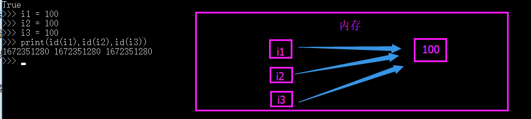

**str:**字符串要从下面这几个大方向讨论：

1.字符串的长度为0或者1，默认都采用了驻留机制（小数据池）。

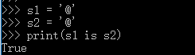

2.字符串的长度>1,且只含有大小写字母，数字，下划线时，才会默认驻留。

 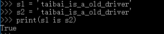

3.用乘法得到的字符串，分两种情况。

3.1 乘数为1时：

仅含大小写字母，数字，下划线，默认驻留。

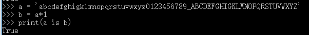

含其他字符，长度<=1,默认驻留。

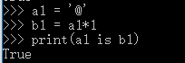

含其他字符，长度>1,默认驻留。


3.2 乘数>=2时：

仅含大小写字母，数字，下划线，总长度<=20,默认驻留。

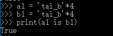

4，指定驻留

```
from sys import intern
a = intern('hello!@'*20)
b = intern('hello!@'*20)
print(a is b)
#指定驻留是你可以指定任意的字符串加入到小数据池中，让其只在内存中创建一个对象，多个变量都是指向这一个字符串。
```

满足以上字符串的规则时，就符合小数据池的概念。

bool值就是True，False，无论你创建多少个变量指向True，False，那么他在内存中只存在一个。

看一下用了小数据池（驻留机制）的效率有多高：

显而易见，节省大量内存在字符串比较时，非驻留比较效率o(n)，驻留时比较效率o(1)。

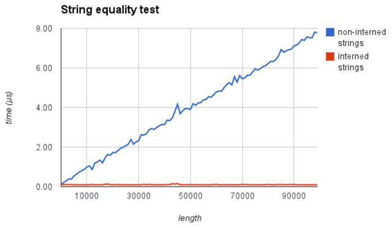

优点：能够提高一些字符串，整数处理任务在时间和空间上的性能；需要值相同的字符串，整数的时候，直接从‘池’里拿来用，避免频繁的创建和销毁，提升效率，节约内存

#### 1.1.13 python中的计数方法

常见的计数方法有两种，可以分别称为：

- **自然计数法**（从 1 开始）—— 更符合人类的习惯
- **程序计数法**（从 0 开始）—— 几乎所有的程序语言都选择从 0 开始计数

因此，大家在编写程序时，应该尽量养成习惯：`除非需求的特殊要求，否则 循环 的计数都从 0 开始`

## 二、Python基础 

### 2.1 第一个python程序

[程序练习](https://github.com/Nicolas-gaofeng/Salute_Python/blob/main/python_basic_02/first_python_01/HelloWorld.py)

- 新建 HelloPython.py文件
- 使用 gedit 编辑 01-HelloPython.py 并且输入以下内容：

```
print("hello python")
print("hello world")
```

- 在终端中输入以下命令执行 HelloPython.py

```
$ python 01-HelloPython.py
```

print 是 python 中我们学习的第一个 函数

print 函数的作用，可以把 "" 内部的内容，输出到屏幕上

- python 用缩进表示语句间的逻辑，缩进量:4字符
- 所有行限制的最大字符数为79

### 2.2 认识Bug

[程序练习](https://github.com/Nicolas-gaofeng/Salute_Python/blob/main/python_basic_02/debug_python_02/debug_python.py)

关于错误

- 编写的程序不能正常执行，或者执行的结果不是我们期望的

- 俗称 BUG，是程序员在开发时非常常见的，初学者常见错误的原因包括：
  1. 手误
  2. 对已经学习过的知识理解还存在不足
  3. 对语言还有需要学习和提升的内容

- 在学习语言时，不仅要学会语言的语法，而且还要学会如何认识错误和解决错误的方法

`每一个程序员都是在不断地修改错误中成长的`

常见错误

- 1> 手误，例如使用 pirnt("Hello     world")

```
NameError: name 'pirnt' is not defined
名称错误：'pirnt' 名字没有定义
```

- 2> 将多条 `print` 写在一行

```
SyntaxError: invalid syntax
语法错误：语法无效
```

每行代码负责完成一个动作

- 3> 缩进错误

```
IndentationError: unexpected indent
缩进错误：不期望出现的缩进
```

- Python 是一个格式非常严格的程序设计语言，每行代码前面都不要增加空格

- 4> python 2.x默认不支持中文

```
SyntaxError: Non-ASCII character '\xe4' in file 01-HelloPython.py on line 3, 
but no encoding declared; 
see http://python.org/dev/peps/pep-0263/ for details
语法错误： 在 01-HelloPython.py 中第 3 行出现了非 ASCII 字符 '\xe4'，但是没有声明文件编码
请访问 http://python.org/dev/peps/pep-0263/ 了解详细信息
```

- `ASCII` 字符只包含 `256` 个字符，不支持中文

单词列表

```
* error 错误
* name 名字
* defined 已经定义
* syntax 语法
* invalid 无效
* Indentation 索引
* unexpected 意外的，不期望的
* character 字符
* line 行
* encoding 编码
* declared 声明
* details 细节，详细信息
* ASCII 一种字符编码
```

PyCharm的调试工具

- **F8 Step Over** 可以单步执行代码，会把函数调用看作是一行代码直接执行
- **F7 Step Into** 可以单步执行代码，如果是函数，会进入函数内部

### 2.3 注释

[程序练习](https://github.com/Nicolas-gaofeng/Salute_Python/blob/main/python_basic_02/notes_python_03/notes_python.py)

#### 2.3.1 注释的作用

使用用自己熟悉的语言，在程序中对某些代码进行标注说明，增强程序的可读性


#### 2.3.2 单行注释(行注释)

- 以 # 开头，# 右边的所有东西都被当做说明文字，而不是真正要执行的程序，只起到辅助说明作用
- 示例代码如下：

```
# 这是第一个单行注释
print("hello python")
```

为了保证代码的可读性，# 后面建议先添加一个空格，然后再编写相应的说明文字

在代码后面增加的单行注释

- 在程序开发时，同样可以使用 # 在代码的后面（旁边）增加说明性的文字
- 但是，需要注意的是，为了保证代码的可读性，注释和代码之间至少要有 两个空格
- 示例代码如下：

```
print("hello python")  # 输出 `hello python`
```

#### 2.3.3 多行注释（块注释）

- 如果希望编写的 注释信息很多，一行无法显示，就可以使用多行注释
- 要在 Python 程序中使用多行注释，可以用 一对连续的 三个引号(单引号和双引号都可以)
- 示例代码如下：

```
"""
这是一个多行注释

在多行注释之间，可以写很多很多的内容……

"""
print("hello python")
```

函数的文档注释

- 在开发中，如果希望给函数添加注释，应该在定义函数的下方，使用连续的三对引号
- 在连续的三对引号之间编写对函数的说明文字
- 在函数调用位置，使用快捷键 CTRL + Q 可以查看函数的说明信息

注意：因为函数体相对比较独立，函数定义的上方，应该和其他代码（包括注释）保留两个空行

#### 2.3.4 什么时候需要使用注释？

1. 注释不是越多越好，对于一目了然的代码，不需要添加注释
2. 对于 复杂的操作，应该在操作开始前写上若干行注释
3. 对于 不是一目了然的代码，应在其行尾添加注释（为了提高可读性，注释应该至少离开代码 2 个空格）
4. 绝不要描述代码，假设阅读代码的人比你更懂 Python，他只是不知道你的代码要做什么

在一些正规的开发团队，通常会有 代码审核 的惯例，就是一个团队中彼此阅读对方的代码

#### 2.3.5 关于代码规范

- Python 官方提供有一系列 PEP（Python Enhancement Proposals） 文档
- 其中第 8 篇文档专门针对 Python 的代码格式 给出了建议，也就是俗称的 PEP 8
- 文档地址：https://www.python.org/dev/peps/pep-0008/
- 谷歌有对应的中文文档：http://zh-google-styleguide.readthedocs.io/en/latest/google-python-styleguide/python_style_rules/

任何语言的程序员，编写出符合规范的代码，是开始程序生涯的第一步

#### 2.3.6 技巧

pycharm下快捷方式：

​	函数注释：点击黄色灯点击insert documentation string stub 自动插入

​	快捷键：ctrl+/ 单行注释

### 2.4 命名规则

[程序练习](https://github.com/Nicolas-gaofeng/Salute_Python/blob/main/python_basic_02/naming_rules_04/naming_rules.py)

#### 2.4.1 标识符和关键字

##### 2.4.1.1 标识符

标示符就是程序员定义的 变量名、函数名

名字 需要有 见名知义 的效果，见下图：


- 标示符可以由 `字母、下划线 和 数字` 组成
- `不能以数字开头`
- `不能与关键字重名`

##### 2.4.1.2 关键字

- 关键字 就是在 Python 内部已经使用的标识符
- 关键字 具有特殊的功能和含义
- 开发者 不允许定义和关键字相同的名字的标示符

通过以下命令可以查看 Python 中的关键字

```
import keyword
print(keyword.kwlist)
```

- import 关键字 可以导入一个 “工具包”
- 在 Python 中不同的工具包，提供有不同的工具

#### 2.4.2 变量的命名规则

命名规则 可以被视为一种 惯例，并无绝对与强制 目的是为了 增加代码的识别和可读性

2. 在定义变量时，为了保证代码格式，= 的左右应该各保留一个空格

3. 变量名只能是字母/数字或下划线的任意组合，注意 Python 中的 标识符 是严格 `区分大小写`

   

4. 变量名的第一个字符不能是数字; 变量名中间不能有空格;  关键字不能作为变量

5. 尽量避免用中文和拼音做变量名


##### 2.4.2.1 下划线命名法

在 Python 中，如果 变量名需要由 二个 或 多个单词 组成时，可以按照以下方式命名

​           i.    每个单词都使用小写字母

​           ii.    单词与单词之间使用 _下划线 连接

o  例如：first_name、last_name、qq_number、qq_password

##### 2.4.2.2 驼峰命名法

- 当 变量名 是由二个或多个单词组成时，还可以利用驼峰命名法来命名

- 小驼峰式命名法

- - 第一个单词以小写字母开始，后续单词的首字母大写
  - 例如：firstName、lastName

- 大驼峰式命名法

- - 每一个单词的首字母都采用大写字母
  - 例如：FirstName、LastName、CamelCase


##### 2.4.2.3 全局变量命名

​	a.全局变量名前应该增加 g_ 或者 gl_ 的前缀

​	b.如果局部变量的名字和全局变量的名字相同,pycharm会在局部变量下方显示一个灰色的虚线

```
# 全局变量命名
gl_num = 10
```

#### 2.4.3 常量的命名规则

​	a.常量即不变的量 如π、e

​	b.一般放在文件最上面

​	c.全部用大写字母表示

#### 2.4.4 文件的命名规则

​	a. 命名文件名时建议只使用 小写字母、数字 和 下划线

​	b. 文件名不能以数字开始

#### 2.4.5 类的命名规则

​	a.驼峰体:变量名由多个单词组成：单词首字母大写

​	b.单词与单词之间没有下划线

​	c.总使用“cls”作为类方法的第一个参数。

#### 2.4.6 模块的命名规则

​	a.与包的规范同。如mymodule。

​	b.除非有很多字母，尽量不要用下划线

因为很多模块文件存与模块名称一致的类，模块采用小写，类采用首字母大写，这样就能区分开模块和类。

#### 2.4.7 包的命名规则

应该是简短的、小写的名字。如果下划线可以改善可读性可以加入。如mypackage。

#### 2.4.8 函数的命名规则

函数名应该为小写，可以用下划线风格单词以增加可读性。如：myfunction，my_example_function。

总使用“self”作为实例方法的第一个参数。
如果一个函数的参数名称和保留的关键字冲突，通常使用一个后缀下划线好于使用缩写或奇怪的拼写。

### 2.5 变量

[程序练习](https://github.com/Nicolas-gaofeng/Salute_Python/blob/main/python_basic_02/variable_python_05/variable_python.py)

程序就是用来处理数据的，而变量就是用来存储数据的

#### 2.5.1 变量的定义及创建

1. 在 Python 中，每个变量 在使用前都必须赋值，变量 赋值以后 该变量 才会被创建
2. 变量名 = 值 

- 等号（=）用来给变量赋值

- - = 左边是一个变量名
  - = 右边是存储在变量中的值

3. 变量定义之后，后续就可以直接使用了
4. 变量名 只有在 第一次出现才是 定义变量
5. 变量名 再次出现，不是定义变量，而是直接使用之前定义过的变量
6. 在内存中创建一个变量，会包括：

- ​	变量的名称

- ​	变量保存的数据

- ​	变量存储数据的类型

- ​	变量的地址（标示）

7. 在 Python 中定义变量是 **不需要指定类型**（在其他很多高级语言中都需要）
8. 使用 type 函数可以查看一个变量的类型

- ```
   type(name)
  ```

#### 2.5.2 变量的输入

1. 所谓 输入，就是 用代码获取 用户通过 键盘 输入的信息

- 例如：去银行取钱，在 ATM 上输入密码
- 在 Python 中，如果要获取用户在 键盘 上的输入信息，需要使用到 input 函数

2. 关于函数

- 一个 提前准备好的功能(别人或者自己写的代码)，可以直接使用，而 不用关心内部的细节

3. input函数实现键盘输入

- 在 Python 中可以使用 input 函数从键盘等待用户的输入

- `用户输入的 任何内容 Python 都认为是一个 字符串`

- 语法如下：

  字符串变量 = input("提示信息：")

4. 类型转换函数

|   函数   |         说明          |
| :------: | :-------------------: |
|  int(x)  |  将 x 转换为一个整数  |
| float(x) | 将 x 转换到一个浮点数 |

#### 2.5.3 变量的输出

苹果单价 9.00 元／斤，购买了 5.00 斤，需要支付 45.00 元

- 在 Python 中可以使用 print 函数将信息输出到控制台

- 如果希望输出文字信息的同时，一起输出数据，就需要使用到 格式化操作符

- % 被称为 格式化操作符，专门用于处理字符串中的格式

- - 包含 % 的字符串，被称为 格式化字符串
  - % 和不同的 字符 连用，不同类型的数据 需要使用 不同的格式化字符

| 格式化字符 |                             含义                             |
| :--------: | :----------------------------------------------------------: |
|     %s     |                            字符串                            |
|     %d     | 有符号十进制整数，%06d 表示输出的整数显示位数，不足的地方使用 0 补全 |
|     %f     |             浮点数，%.2f 表示小数点后只显示两位              |
|     %%     |                            输出 %                            |

- 语法格式如下：

```
print("格式化字符串" % 变量1)
print("格式化字符串" % (变量1, 变量2...))
```

#### 2.5.4 变量的引用

1. 变量 和 数据 都是保存在 内存 中的
2. 在 Python 中 函数 的 参数传递以及 返回值 都是靠 **引用** 传递的

3. 引用的概念

在 Python 中

- 变量 和 数据是分开存储的
- 数据 保存在内存中的一个位置
- 变量中保存着数据在内存中的地址
- 变量 中 记录数据的地址，就叫做 引用
- 使用 id() 函数可以查看变量中保存数据所在的 内存地址

注意：如果变量已经被定义，当给一个变量赋值的时候，本质上是 修改了数据的引用

- 变量 不再 对之前的数据引用
- 变量 改为 对新赋值的数据引用

4. 变量引用的示例

在 Python 中，变量的名字类似于 便签纸 贴在 数据上

- 定义一个整数变量 a，并且赋值为 1

| 代码  |                             图示                             |
| :---: | :----------------------------------------------------------: |
| a = 1 |  |

- 将变量 a 赋值为 2

| 代码  |                             图示                             |
| :---: | :----------------------------------------------------------: |
| a = 2 |  |

- 定义一个整数变量 b，并且将变量 a 的值赋值给 b

| 代码  |                             图示                             |
| :---: | :----------------------------------------------------------: |
| b = a |  |

变量 b 是第 2 个贴在数字 2 上的标签

#### 2.5.5 局部变量和全局变量

##### 2.5.5.1 局部变量

1. 局部变量 是在 函数内部 定义的变量，只能在函数内部使用
2. 函数执行结束后，函数内部的局部变量，会被系统回收
3. 不同的函数，可以定义相同的名字的局部变量，但是 彼此之间 不会产生影响
4. 局部变量的作用：在函数内部使用，临时保存 函数内部需要使用的数据

5. 局部变量的生命周期

- 所谓 生命周期就是变量从 被创建到 被系统回收的过程
- 局部变量 在 函数执行时才会被创建
- 函数执行结束后 局部变量 被系统回收
- 局部变量在生命周期 内，可以用来存储 函数内部临时使用到的数据

##### 2.5.5.2 全局变量

1. 全局变量是在 函数外部定义的变量，所有函数内部都可以使用这个变量

 注意：函数执行时，需要处理变量时会：

- 首先查找函数内部是否存在指定名称 的局部变量，如果有，直接使用
- 如果没有，查找函数外部是否存在指定名称 的全局变量，如果有，直接使用
- 如果还没有，程序报错！

2. 函数不能直接修改全局变量的引用

- 全局变量 是在 函数外部定义 的变量（没有定义在某一个函数内），所有函数 内部 都可以使用这个变量

提示：在其他的开发语言中，大多 不推荐使用全局变量 —— 可变范围太大，导致程序不好维护！

- 在函数内部，可以通过全局变量的引用获取对应的数据
- 但是，不允许直接修改全局变量的引用 —— 使用赋值语句修改全局变量的值

3. 在函数内部修改全局变量的值

- 如果在函数中需要修改全局变量，需要使用 global 进行声明

4. 为了保证所有的函数都能够正确使用到全局变量，应该 将全局变量定义在其他函数的上方

5. 代码结构示意图如下

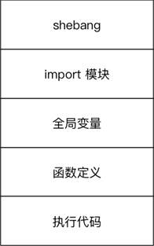

### 2.6 数据类型

数据类型可以分为 **数字型** 和 **非数字型**

#### 2.6.1 数字型

[程序练习](https://github.com/Nicolas-gaofeng/Salute_Python/blob/main/python_basic_02/data_type_python_07/data_type_digital.py)

##### 2.6.1.1 整型 (int)

​	提示：在 Python 2.x 中，整数根据保存数值的长度还分为：

​		int（整数）

​		long（长整数）

##### 2.6.1.2 浮点型（float）

##### 2.6.1.3 布尔型（bool）

​	真 True 非 0 数 —— 非零即真 对应的数字是1

​	假 False 对应的数字是0

##### 2.6.1.4 复数型 (complex)

主要用于科学计算，例如：平面场问题、波动问题、电感电容等问题

#### 2.6.2 非数字型

##### 2.6.2.1 字符串

[程序练习](https://github.com/Nicolas-gaofeng/Salute_Python/blob/main/python_basic_02/data_type_python_07/data_type_string.py)

1. 字符串的定义

​	字符串就是 一串字符，是编程语言中表示文本的数据类型

2. 在 Python 中可以使用 一对双引号" 或者 一对单引号 ' 定义一个字符串,大多数编程语言都是用 " 来定义字符串

- - 虽然可以使用 \" 或者 \' 做字符串的转义，但是在实际开发中：

  - - 如果字符串内部需要使用 "，可以使用 ' 定义字符串
    - 如果字符串内部需要使用 '，可以使用 " 定义字符串

3. 可以使用 索引获取一个字符串中 指定位置的字符，索引计数从 0 开始
4. 也可以使用 for 循环遍历 字符串中每一个字符

```python
string = "Hello Python"
for c in string:
	print(c)
```

 

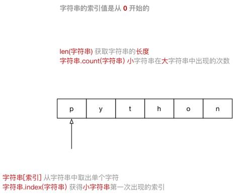

5. 字符串的常用操作

- 在 ipython3 中定义一个 字符串，例如：hello_str = ""
- 输入 hello_str. 按下 TAB 键，ipython 会提示 字符串 能够使用的 方法 如下：

```
In [1]: hello_str.
hello_str.capitalize  hello_str.isidentifier hello_str.rindex
hello_str.casefold   hello_str.islower    hello_str.rjust
hello_str.center    hello_str.isnumeric   hello_str.rpartition
hello_str.count     hello_str.isprintable  hello_str.rsplit
hello_str.encode    hello_str.isspace    hello_str.rstrip
hello_str.endswith   hello_str.istitle    hello_str.split
hello_str.expandtabs  hello_str.isupper    hello_str.splitlines
hello_str.find     hello_str.join     hello_str.startswith
hello_str.format    hello_str.ljust     hello_str.strip
hello_str.format_map  hello_str.lower     hello_str.swapcase
hello_str.index     hello_str.lstrip    hello_str.title
hello_str.isalnum    hello_str.maketrans   hello_str.translate
hello_str.isalpha    hello_str.partition   hello_str.upper
hello_str.isdecimal   hello_str.replace    hello_str.zfill
hello_str.isdigit    hello_str.rfind
```

提示：正是因为 python 内置提供的方法足够多，才使得在开发时，能够针对字符串进行更加灵活的操作！应对更多的开发需求！

1)判断类型

|        方法        |                             说明                             |
| :----------------: | :----------------------------------------------------------: |
|  string.isspace()  |            如果 string 中只包含空格，则返回 True             |
|  string.isalnum()  | 如果 string 至少有一个字符并且所有字符都是字母或数字则返回 True |
|  string.isalpha()  |  如果 string 至少有一个字符并且所有字符都是字母则返回 True   |
| string.isdecimal() |         如果 string 只包含数字则返回 True，全角数字          |
|  string.isdigit()  |    如果 string 只包含数字则返回 True，全角数字、⑴、\u00b2    |
| string.isnumeric() |    如果 string 只包含数字则返回 True，全角数字，汉字数字     |
|  string.istitle()  |   如果 string 是标题化的(每个单词的首字母大写)则返回 True    |
|  string.islower()  | 如果 string 中包含至少一个区分大小写的字符，并且所有这些(区分大小写的)字符都是小写，则返回 True |
|  string.isupper()  | 如果 string 中包含至少一个区分大小写的字符，并且所有这些(区分大小写的)字符都是大写，则返回  True |

2) 查找和替换

|                          方法                           |                             说明                             |
| :-----------------------------------------------------: | :----------------------------------------------------------: |
|                 string.startswith(str)                  |          检查字符串是否是以 str 开头，是则返回 True          |
|                  string.endswith(str)                   |          检查字符串是否是以 str 结束，是则返回 True          |
|       string.find(str, start=0,  end=len(string))       | 检测 str 是否包含在 string 中，如果 start 和 end 指定范围，则检查是否包含在指定范围内，如果是返回开始的索引值，否则返回 -1 |
|       string.rfind(str, start=0, end=len(string))       |             类似于 find()，不过是从右边开始查找              |
|       string.index(str, start=0, end=len(string))       |     跟 find() 方法类似，不过如果 str 不在 string 会报错      |
|      string.rindex(str, start=0, end=len(string))       |               类似于 index()，不过是从右边开始               |
| string.replace(old_str, new_str, num=string.count(old)) | 把 string 中的 old_str 替换成 new_str，如果 num 指定，则替换不超过 num 次 |

3)大小写转换

|        方法         |               说明               |
| :-----------------: | :------------------------------: |
| string.capitalize() |     把字符串的第一个字符大写     |
|   string.title()    |   把字符串的每个单词首字母大写   |
|   string.lower()    | 转换 string 中所有大写字符为小写 |
|   string.upper()    |  转换 string 中的小写字母为大写  |
|  string.swapcase()  |      翻转 string 中的大小写      |

4) 文本对齐

|         方法         |                             说明                             |
| :------------------: | :----------------------------------------------------------: |
| string.ljust(width)  | 返回一个原字符串左对齐，并使用空格填充至长度 width 的新字符串 |
| string.rjust(width)  | 返回一个原字符串右对齐，并使用空格填充至长度 width 的新字符串 |
| string.center(width) | 返回一个原字符串居中，并使用空格填充至长度 width 的新字符串  |

5) 去除空白字符

|      方法       |                说明                |
| :-------------: | :--------------------------------: |
| string.lstrip() | 截掉 string 左边（开始）的空白字符 |
| string.rstrip() | 截掉 string 右边（末尾）的空白字符 |
| string.strip()  |   截掉 string 左右两边的空白字符   |

6) 拆分和连接

|           方法            |                             说明                             |
| :-----------------------: | :----------------------------------------------------------: |
|   string.partition(str)   | 把字符串 string 分成一个 3 元素的元组 (str前面,  str, str后面) |
|  string.rpartition(str)   |        类似于 partition() 方法，不过是从右边开始查找         |
| string.split(str="", num) | 以 str 为分隔符拆分  string，如果 num 有指定值，则仅分隔 num +  1 个子字符串，str 默认包含 '\r', '\t',  '\n' 和空格 |
|    string.splitlines()    | 按照行('\r', '\n', '\r\n')分隔，返回一个包含各行作为元素的列表 |
|     string.join(seq)      | 以 string 作为分隔符，将 seq 中所有的元素（的字符串表示）合并为一个新的字符串 |

6. 字符串的切片 

- 切片方法适用于 字符串、列表、元组

- - 切片 使用 索引值 来限定范围，从一个大的 字符串 中 切出 小的 字符串
  - 列表 和 元组 都是 有序 的集合，都能够通过索引值 获取到对应的数据
  - 字典 是一个 无序 的集合，是使用 键值对保存数据

字符串[开始索引:结束索引:步长]

**注意**：

a. 指定的区间属于 **左闭右开** 型 [开始索引, 结束索引) => 开始索引 =< 范围 < 结束索引

1. - 从 起始 位开始，到 结束位的前一位结束（不包含结束位本身)

b. 从头开始，开始索引 数字可以省略，冒号不能省略

c. 到末尾结束，结束索引 数字可以省略，冒号不能省略

d. 步长默认为 1，如果连续切片，数字和冒号都可以省略

**索引的顺序和倒序**

- 在 Python 中不仅支持 顺序索引，同时还支持 倒序索引

- 所谓倒序索引就是 从右向左 计算索引

- - 最右边的索引值是 **-1**，依次递减

**字符串中的转义字符**

- \t 在控制台输出一个 制表符，协助在输出文本时垂直方向保持对齐
- \n 在控制台输出一个 换行符

制表符的功能是在不使用表格的情况下在垂直方向按列对齐文本

| 转义字符 |    描述    |
| :------: | :--------: |
|    \\    | 反斜杠符号 |
|    \'    |   单引号   |
|    \"    |   双引号   |
|    \n    |    换行    |
|    \t    | 横向制表符 |
|    \r    |    回车    |

`unicode 字符串`

- 在 Python 2.x中，即使指定了文件使用 UTF-8 的编码格式，但是在遍历字符串时，仍然会以字节为单位遍历字符串
- 要能够正确的遍历字符串，在定义字符串时，需要在字符串的引号前，增加一个小写字母 `u`，告诉解释器这是一个unicode字符串（使用 UTF-8编码格式的字符串）

```python
# *-* coding:utf8 *-*
# 在字符串前，增加一个 `u` 表示这个字符串是一个 utf8 字符串
hello_str = u"你好世界"
print(hello_str)
for c in hello_str:
    print(c)
```

### 

##### 2.6.2.2 列表

[程序练习](https://github.com/Nicolas-gaofeng/Salute_Python/blob/main/python_basic_02/data_type_python_07/data_type_list.py)

1. 列表的定义

- List（列表） 是 Python 中使用 最频繁 的数据类型，在其他语言中通常叫做 数组

- 专门用于存储 一串 信息

- 列表用 [] 定义，数据 之间使用 , 分隔

- 列表的 索引 从 0 开始

- - 索引 就是数据在 列表 中的位置编号，索引 又可以被称为 下标

注意：从列表中取值时，如果 超出索引范围，程序会报错

name_list = ["zhangsan", "lisi", "wangwu"]

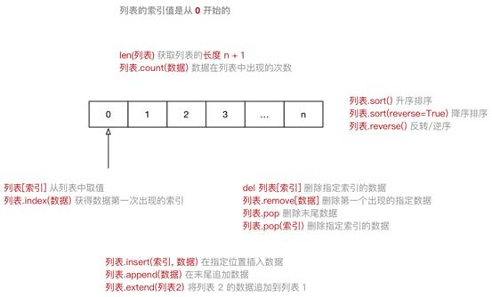

2. 列表常用操作

- 在 ipython3 中定义一个 列表，例如：name_list = []
- 输入 name_list. 按下 TAB 键，ipython 会提示 列表 能够使用的 方法 如下：

```
In [1]: name_list.
name_list.append  name_list.count  name_list.insert  name_list.reverse
name_list.clear  name_list.extend  name_list.pop   name_list.sort
name_list.copy   name_list.index  name_list.remove 
```

| 序号* | 分类 |  关键字 / 函数 / 方法   |           说明           |
| :---: | :--: | :---------------------: | :----------------------: |
|   1   | 增加 | 列表.insert(索引, 数据) |    在指定位置插入数据    |
|       |      |    列表.append(数据)    |      在末尾追加数据      |
|       |      |   列表.extend(列表2)    | 将列表2 的数据追加到列表 |
|   2   | 修改 |    列表[索引] = 数据    |    修改指定索引的数据    |
|   3   | 删除 |     del 列表[索引]      |    删除指定索引的数据    |
|       |      |    列表.remove[数据]    | 删除第一个出现的指定数据 |
|       |      |        列表.pop         |       删除末尾数据       |
|       |      |     列表.pop(索引)      |     删除指定索引数据     |
|       |      |       列表.clear        |         清空列表         |
|   4   | 统计 |        len(列表)        |         列表长度         |
|       |      |    列表.count(数据)     |  数据在列表中出现的次数  |
|   5   | 排序 |       列表.sort()       |         升序排序         |
|       |      | 列表.sort(reverse=True) |         降序排序         |
|       |      |     列表.reverse()      |        逆序、反转        |

3. del关键字

- 使用 del 关键字(delete) 同样可以删除列表中元素
- del 关键字本质上是用来 将一个变量从内存中删除的
- 如果使用 del 关键字将变量从内存中删除，后续的代码就不能再使用这个变量了

```
del name_list[1]
```

在日常开发中，要从列表删除数据，建议 使用列表提供的方法

- 关键字 是 Python 内置的、具有特殊意义的标识符

```
In [1]: import keyword
In [2]: print(keyword.kwlist)
In [3]: print(len(keyword.kwlist))
```

关键字后面不需要使用括号

4. 循环遍历

- 遍历就是 从头到尾依次 从 列表中获取数据

- - 在 循环体内部 针对 每一个元素，执行相同的操作

- 在 Python 中为了提高列表的遍历效率，专门提供的 迭代 iteration 遍历

- 使用 for 就能够实现迭代遍历

 for 循环内部使用的变量 in 列表

```python
for name in name_list:
  # 循环内部针对列表元素进行操作
	print(name)
```

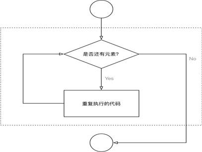

4. 应用场景

- 尽管 Python 的 列表中可以 存储不同类型的数据

- 但是在开发中，更多的应用场景是

- 1. 列表 存储相同类型的数据
  2. 通过 迭代遍历，在循环体内部，针对列表中的每一项元素，执行相同的操作

##### 2.6.2.3 元组

[程序练习](https://github.com/Nicolas-gaofeng/Salute_Python/blob/main/python_basic_02/data_type_python_07/data_type_tuple.py)

1. 元组的定义

- Tuple（元组）与列表类似，不同之处在于元组的 元素不能修改

- - 元组 表示多个元素组成的序列
  - 元组 在 Python 开发中，有特定的应用场景

- 用于存储 一串 信息，数据 之间使用 , 分隔

- 元组用 () 定义

- 元组的 索引 从 0 开始

- - 索引 就是数据在 元组 中的位置编号

```python
info_tuple = ("zhangsan", 18, 1.75)
```

创建空元组

```python
info_tuple = ()
```

元组中 只包含一个元素 时，需要 在元素后面添加逗号

```python
info_tuple = (50, )
```

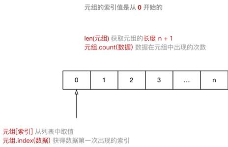

2. 元组常用操作

- 在 ipython3 中定义一个 元组，例如：info = ()
- 输入 info. 按下 TAB 键，ipython 会提示 元组 能够使用的函数如下：

```python
info.count info.index
```

3. 循环遍历 

- 取值 就是从 元组 中获取存储在指定位置的数据
- 遍历 就是 从头到尾依次从元组中获取数据

 for 循环内部使用的变量 in 元组

```python
for item in info:
  	# 循环内部针对元组元素进行操作
	print(item)
```

- 在 Python 中，可以使用 for 循环遍历所有非数字型类型的变量：列表、元组、字典以及字符串
- 提示：在实际开发中，除非能够确认元组中的数据类型，否则针对元组的循环遍历需求并不是很多

4. 应用场景

- 尽管可以使用 for in 遍历 元组

- 但是在开发中，更多的应用场景是：

- - 函数的 参数 和 返回值，一个函数可以接收任意多个参数，或者一次返回多个数据
  - 格式字符串，格式化字符串后面的 () 本质上就是一个元组
  - 让列表不可以被修改，以保护数据安全

```python
info = ("zhangsan", 18)
print("%s 的年龄是 %d" % info)
```

5. 元组和列表之间的转换

- 使用 list 函数可以把元组转换成列表

```python
list(元组) 
```

- 使用 tuple 函数可以把列表转换成元组

```python
tuple(列表)
```

##### 2.6.2.4 字典

[程序练习](https://github.com/Nicolas-gaofeng/Salute_Python/blob/main/python_basic_02/data_type_python_07/data_type_dict.py)

1. 字典的定义 

- dictionary（字典）是除列表以外Python 之中最灵活的数据类型

- 字典同样可以用来存储多个数据

- - 通常用于存储描述一个物体的相关信息

- 和列表的区别

- - 列表是有序的对象集合
  - 字典是无序的对象集合

- 字典用 {} 定义

- 字典使用键值对存储数据，键值对之间使用 , 分隔

- - 键 key 是索引
  - 值 value 是数据
  - 键 和 值 之间使用 : 分隔
  - 键必须是唯一的
  - 值可以取任何数据类型，但 键 只能使用 字符串、数字 或 元组

```python
xiaoming = {"name": "小明",
    	     "age": 18,
             "gender": True,
             "height": 1.75}
```

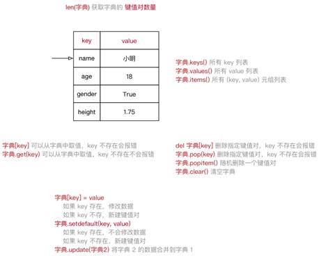

2. 字典常用操作 

- 在 ipython3 中定义一个 字典 ，例如：xiaoming = {}
- 输入 xiaoming. 按下 TAB 键，ipython 会提示 字典 能够使用的函数如下：

```python
In [1]: xiaoming.
xiaoming.clear    xiaoming.items    xiaoming.setdefault
xiaoming.copy    xiaoming.keys    xiaoming.update
xiaoming.fromkeys  xiaoming.pop     xiaoming.values
xiaoming.get     xiaoming.popitem  
```

3. 循环遍历 

-  遍历就是依次从字典中获取所有键值对

for 循环内部使用的 key 的变量 in 字典 

```python
for k in xiaoming:
	print("%s: %s" % (k, xiaoming[k]))
```

提示：在实际开发中，由于字典中每一个键值对保存数据的类型是不同的，所以针对字典的循环遍历需求并不是很多

4. 应用场景

- 尽管可以使用 for in 遍历字典

- 但是在开发中，更多的应用场景是：

- - 使用多个键值对，存储描述一个物体的相关信息 —— 描述更复杂的数据信息
  - 将多个字典放在一个列表中，再进行遍历，在循环体内部针对每一个字典进行相同的处理

```python
card_list = [{"name": "张三",
       		"qq": "12345",
       		"phone": "110"},
       		{"name": "李四",
       		"qq": "54321",
       		"phone": "10086"}
       		]
```

##### 2.6.2.5 集合

[程序练习](https://github.com/Nicolas-gaofeng/Salute_Python/blob/main/python_basic_02/data_type_python_07/data_type_set.py)

集合是可变类型

不能重复 没有顺序

一系列互不相等元素的无序集合

元素必须是不可变类型：数字，字符串或元组，可视作字典的键

可以看做是没有值，或者值为None的字典

可用于去重

#### 2.6.3 容器公共方法

[程序练习](https://github.com/Nicolas-gaofeng/Salute_Python/blob/main/python_basic_02/data_type_python_07/data_type_public_method.py)

1. Python内置函数

Python 包含了以下内置函数：

|       函数        |               描述                |            备注             |
| :---------------: | :-------------------------------: | :-------------------------: |
|     len(item)     |        计算容器中元素个数         |                             |
|     del(item)     |             删除变量              |       del 有两种方式        |
|     max(item)     |       返回容器中元素最大值        | 如果是字典，只针对 key 比较 |
|     min(item)     |       返回容器中元素最小值        | 如果是字典，只针对 key 比较 |
| cmp(item1, item2) | 比较两个值，-1 小于/0 相等/1 大于 | Python 3.x 取消了 cmp 函数  |

**注意**

- 字符串比较符合以下规则：     "0" < "A" < "a"

2. 切片 

| 描述 |    Python表达式    |  结果   |   支持的数据类型   |
| :--: | :----------------: | :-----: | :----------------: |
| 切片 | "0123456789"[::-2] | "97531" | 字符串、列表、元组 |

- 切片使用索引值来限定范围，从一个大的字符串中切出小的字符串
- 列表和元组都是有序的集合，都能够通过索引值获取到对应的数据
- 字典是一个无序的集合，是使用键值对保存数据

3. 运算符

|    运算符    |     Python表达式      |             结果             |      描述      |      支持的数据类型      |
| :----------: | :-------------------: | :--------------------------: | :------------: | :----------------------: |
|      +       |    [1, 2] + [3, 4]    |         [1, 2, 3, 4]         |      合并      |    字符串、列表、元组    |
|      *       |      ["Hi!"] * 4      | ['Hi!', 'Hi!', 'Hi!', 'Hi!'] |      重复      |    字符串、列表、元组    |
|      in      |    3 in (1, 2, 3)     |             True             |  元素是否存在  | 字符串、列表、元组、字典 |
|    not in    |  4 not in (1, 2, 3)   |             True             | 元素是否不存在 | 字符串、列表、元组、字典 |
| > >= == < <= | (1, 2, 3) < (2, 2, 3) |             True             |    元素比较    |    字符串、列表、元组    |

**注意**

- in 在对 字典 操作时，判断的是 字典的键
- in 和 not in 被称为 成员运算符

**成员运算符**

成员运算符用于测试序列中是否包含指定的成员

| 运算符 |                          描述                          |             实例              |
| :----: | :----------------------------------------------------: | :---------------------------: |
|   in   |   如果在指定的序列中找到值返回 True，否则返回 False    |   3 in (1, 2, 3) 返回 True    |
| not in | 如果在指定的序列中没有找到值返回 True，否则返回  False | 3 not in (1, 2, 3) 返回 False |

注意：在对字典操作时，判断的是字典的键

4. 完整的 for 循环语法

- 在 Python 中完整的 for 循环 的语法如下：

```python
for 变量 in 集合:
  # 循环体代码
else:
  # 没有通过break退出循环，循环结束后，会执行的代码
```

应用场景

- 在 迭代遍历嵌套的数据类型时，例如一个列表包含了多个字典

- 需求：要判断某一个字典中是否存在指定的值

- - 如果存在，提示并且退出循环
  - 如果不存在，在循环整体结束后，希望得到一个统一的提示

```python
students = [
        {"name": "阿土", "age": 20, "gender": True, "height": 1.7, "weight": 75.0},
        {"name": "小美", "age": 19, "gender": False, "height": 1.6, "weight": 45.0},
    ]
find_name = "阿土"
for stu_dict in students:
    # 判断当前遍历的字典中姓名是否为find_name
    if stu_dict["name"] == find_name:
        print("找到了")
        # 如果已经找到，直接退出循环，就不需要再对后续的数据进行比较
        break
else:
	print("没有找到")
print("循环结束")
```

#### 2.6.4 可变和不可变类型

1. 不可变类型，内存中的数据不允许被修改：

- 数字类型 int, bool, float, complex, long(2.x)
- 字符串 str
- 元组 tuple

2. 可变类型，内存中的数据可以被修改：

- 列表 list
- 字典 dict

注意：字典的key只能使用不可变类型的数据

**注意**

1. 可变类型的数据变化，是通过方法来实现的

2. 如果给一个可变类型的变量，赋值了一个新的数据，引用会修改

3. - 变量不再对之前的数据引用
   - 变量改为对新赋值的数据引用

3. 哈希(hash)

- Python 中内置有一个名字叫做 hash(o) 的函数

- - 接收一个不可变类型的数据作为参数
  - 返回结果是一个整数

- 哈希 是一种算法，其作用就是提取数据的特征码（指纹）

- - 相同的内容得到相同的结果
  - 不同的内容得到不同的结果

- 在 Python 中，设置字典的键值对时，会首先对 key 进行 hash 已决定如何在内存中保存字典的数据，以方便后续对字典的操作：增、删、改、查

- - 键值对的 key 必须是不可变类型数据
  - 键值对的 value 可以是任意类型的数据

### 2.7 数学运算

[程序练习](https://github.com/Nicolas-gaofeng/Salute_Python/blob/main/python_basic_02/arithmetic_operator_06/arithmetic_operator.py)

#### 2.7.1 算数运算符

计算机，顾名思义就是负责进行数学计算，并且存储计算结果的电子设备。

- 算数运算符是 运算符的一种
- 是完成基本的算术运算使用的符号，用来处理四则运算

| 运算符 |  描述  |                    实例                    |
| :----: | :----: | :----------------------------------------: |
|   +    |   加   |                10 + 20 = 30                |
|   -    |   减   |               10 - 20 = -10                |
|   *    |   乘   |               10 * 20 = 200                |
|   /    |   除   |               10 / 20 = 0.5                |
|   //   | 取整除 | 返回除法的整数部分（商） 9 // 2 输出结果 4 |
|   %    | 取余数 |          返回除法的余数 9 % 2 = 1          |
|   **   |   幂   |         又称次方、乘方，2 ** 3 = 8         |

- 在 Python 中 * 运算符还可以用于字符串，计算结果就是字符串重复指定次数的结果

```
In [1]: "-" * 50
Out[1]: '----------------------------------------' 
```

#### 2.7.2 比较（关系）运算符 

| 运算符 |                             描述                             |
| :----: | :----------------------------------------------------------: |
|   ==   | 检查两个操作数的值是否 **相等**，如果是，则条件成立，返回  True |
|   !=   | 检查两个操作数的值是否 **不相等**，如果是，则条件成立，返回 True |
|   >    | 检查左操作数的值是否 **大于** 右操作数的值，如果是，则条件成立，返回 True |
|   <    | 检查左操作数的值是否 **小于** 右操作数的值，如果是，则条件成立，返回 True |
|   >=   | 检查左操作数的值是否 **大于或等于** 右操作数的值，如果是，则条件成立，返回 True |
|   <=   | 检查左操作数的值是否 **小于或等于** 右操作数的值，如果是，则条件成立，返回 True |

Python 2.x 中判断 不等于 还可以使用 <> 运算符

!= 在 Python 2.x 中同样可以用来判断 不等于

#### 2.7.3 逻辑运算符

- 在程序开发中，通常 在判断条件时，会需要同时判断多个条件
- 只有多个条件都满足，才能够执行后续代码，这个时候需要使用到 逻辑运算符
- 逻辑运算符可以把多个条件按照逻辑进行连接，变成更复杂的条件
- Python 中的逻辑运算符包括：**与 and**／**或 or**／**非 not** 三种

| 运算符 | 逻辑表达式 |                             描述                             |
| :----: | :--------: | :----------------------------------------------------------: |
|  and   |  x and y   | 只有 x 和 y 的值都为 True，才会返回 True   否则只要 x 或者 y 有一个值为 False，就返回 False |
|   or   |   x or y   | 只要 x 或者 y 有一个值为 True，就返回 True   只有 x 和 y 的值都为 False，才会返回 False |
|  not   |   not x    |   如果 x 为 True，返回 False   如果 x 为 False，返回 True    |

1. and

条件1 and 条件2

- 与／并且
- 两个条件同时满足，返回 True
- 只要有一个不满足，就返回 False

| 条件 1 | 条件 2 |  结果  |
| :----: | :----: | :----: |
|  成立  |  成立  |  成立  |
|  成立  | 不成立 | 不成立 |
| 不成立 |  成立  | 不成立 |
| 不成立 | 不成立 | 不成立 |

2. or

条件1 or 条件2

-  或 ／ 或者 
- 两个条件只要有一个满足，返回 True
- 两个条件都不满足，返回 False

| 条件 1 | 条件 2 |  结果  |
| :----: | :----: | :----: |
|  成立  |  成立  |  成立  |
|  成立  | 不成立 |  成立  |
| 不成立 |  成立  |  成立  |
| 不成立 | 不成立 | 不成立 |

3. not

not 条件

- 非／不是

|  条件  |  结果  |
| :----: | :----: |
|  成立  | 不成立 |
| 不成立 |  成立  |

#### 2.7.4 赋值运算符 

- 在 Python 中，使用 = 可以给变量赋值
- 在算术运算时，为了简化代码的编写，Python 还提供了一系列的 与 算术运算符对应的 赋值运算符
- 注意：赋值运算符中间不能使用空格

| 运算符 |          描述          |                     实例                     |
| :----: | :--------------------: | :------------------------------------------: |
|   =    |    简单的赋值运算符    |    c = a + b 将 a + b 的运算结果赋值为 c     |
|   +=   |     加法赋值运算符     |           c += a 等效于 c = c + a            |
|   -=   |     减法赋值运算符     |           c -= a 等效于 c = c - a            |
|   *=   |     乘法赋值运算符     |           c *= a 等效于 c = c * a            |
|   /=   |     除法赋值运算符     |           c /= a 等效于 c = c / a            |
|  //=   |    取整除赋值运算符    |          c //= a 等效于 c = c // a           |
|   %=   | 取 模 (余数)赋值运算符 |           c %= a 等效于 c = c % a            |
|  **=   |      幂赋值运算符      | c *~= a 等效于  c = c ** a  （~用来比表示*） |

#### 2.7.5 运算符的优先级 

- 和数学中的运算符的优先级一致，在 Python 中进行数学计算时，同样也是：
  - 先乘除后加减
  - 同级运算符是 从左至右 计算
  - 可以使用 () 调整计算的优先级

- 以下表格的算数优先级由高到最低顺序排列

|          运算符          |          描述          |
| :----------------------: | :--------------------: |
|            **            |    幂 (最高优先级)     |
|         * / % //         | 乘、除、取余数、取整除 |
|           + -            |       加法、减法       |
|        <= < > >=         |       比较运算符       |
|          == !=           |       等于运算符       |
| = %= /= //= -= += *= **= |       赋值运算符       |
|        not and or        |       逻辑运算符       |

优先级 （）> not > and > or

#### 2.7.6 不同类型变量之间的计算

1) 数字型变量 之间可以直接计算

- 在 Python 中，两个数字型变量是可以直接进行算数运算的

- 如果变量是 bool 型，在计算时

- - True 对应的数字是 1
  - False 对应的数字是 0

2) 字符串变量 之间使用 + 拼接字符串

- 在 Python 中，字符串之间可以使用 + 拼接生成新的字符串

```
In [1]: first_name = "三"
In [2]: last_name = "张"
In [3]: first_name + last_name
Out[3]: '三张'
```

3) 字符串变量 可以和 整数 使用* 重复拼接相同的字符串

```
In [1]: "-" * 50
Out[1]: '--------------------------------------------------'
```

4) 数字型变量 和 字符串 之间 不能进行其他计算 

```
In [1]: first_name = "zhang"
In [2]: x = 10
In [3]: x + first_name
\---------------------------------------------------------------------------
TypeError: unsupported operand type(s) **for** +: 'int' **and** 'str'
类型错误：`+` 不支持的操作类型：`int` 和 `str
```

### 2.8 迭代器、生成器

### 2.9 条件分支结构

[程序练习](https://github.com/Nicolas-gaofeng/Salute_Python/blob/main/python_basic_02/conditional_branching_structure_08/conditional_branching_structure.py)

1. 开发中的应用场景 

生活中的判断几乎是无所不在的，我们每天都在做各种各样的选择，如果这样？如果那样？……                       

 

 程序中的判断

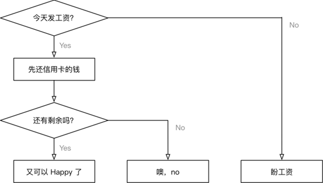

```
if 今天发工资:
  先还信用卡的钱
  if 有剩余:
    又可以happy了，O(∩_∩)O哈哈~
  else:
    噢，no。。。还的等30天
else:
  盼着发工资
```

判断的定义

- 如果 条件满足，才能做某件事情，
- 如果 条件不满足，就做另外一件事情，或者什么也不做

正是因为有了判断，才使得程序世界丰富多彩，充满变化！

判断语句 又被称为 “分支语句”，正是因为有了判断，才让程序有了很多的分支

2. if 语句体验 

a. 判断语句基本语法

在 Python 中，if 语句就是用来进行判断的，格式如下：

```python
if 要判断的条件:
	条件成立时，要做的事情
	……
```

注意：代码的缩进为一个 tab 键，或者 4个空格 —— 建议使用空格

- 在 Python 开发中，Tab 和空格不要混用！

我们可以把整个 if 语句以及缩进部分看成一个完整的代码块

3. else 处理条件不满足的情况

在 Python 中，else，格式如下：

```python
if 要判断的条件:
	条件成立时，要做的事情
  ……
else:
	条件不成立时，要做的事情
  ……
```

**注意**：

- if 和 else 语句以及各自的缩进部分共同是一个完整的代码块

4. elif

- 在开发中，使用 if 可以判断条件
- 使用 else 可以处理条件不成立的情况
- 但是，如果希望再增加一些条件，条件不同，需要执行的代码也不同时，就可以使用 elif
- 语法格式如下：

```python
if 条件1:
	条件1满足执行的代码
  	……
elif 条件2:
	条件2满足时，执行的代码
  	……
elif 条件3:
  	条件3满足时，执行的代码
 	……
else:
  	以上条件都不满足时，执行的代码
  	……
```

**注意**

1. elif 和 else 都必须和 if 联合使用，而不能单独使用
2. 可以将 if、elif 和 else 以及各自缩进的代码，看成一个完整的代码块

5. if的嵌套

elif 的应用场景是同时判断多个条件，所有的条件是平级的

- 在开发中，使用if进行条件判断，如果希望在条件成立的执行语句中再增加条件判断，就可以使用if的嵌套
- if 的嵌套的应用场景就是：在之前条件满足的前提下，再增加额外的判断
- if 的嵌套的语法格式，除了缩进之外和之前的没有区别
- 语法格式如下：

```
if 条件 1:
	条件 1 满足执行的代码
	if 条件 1 基础上的条件 2:
		条件 2 满足时，执行的代码
  	# 条件 2 不满足的处理 
 	else:
		条件 2 不满足时，执行的代码
# 条件 1 不满足的处理 
else:
  条件1 不满足时，执行的代码
  ……
```

### 2.10 循环结构

[程序练习](https://github.com/Nicolas-gaofeng/Salute_Python/blob/main/python_basic_02/Loop_structure_09/Loop_structure.py)

程序的三大流程

- 在程序开发中，一共有三种流程方式：

- - **顺序** —— 从上向下，顺序执行代码
  - **分支** —— 根据条件判断，决定执行代码的分支
  - **循环** —— 让特定代码重复执行                  

#### 2.10.1 while循环

- 循环的作用就是让指定的代码重复的执行

- while 循环最常用的应用场景就是让执行的代码按照指定的次数重复执行


1. while语句基本语法

初始条件设置 —— 通常是重复执行的 计数器

```python
while 条件(判断 计数器 是否达到 目标次数):
	条件满足时，做的事情1
  	条件满足时，做的事情2
  	条件满足时，做的事情3
  	...(省略)...
    处理条件(计数器 + 1)
```

**注意**：

- while 语句以及缩进部分是一个完整的代码块

死循环:由于程序员的原因，忘记在循环内部修改循环的判断条件，导致循环持续执行，程序无法终止！

2. 循环计算

在程序开发中，通常会遇到 利用循环重复计算的需求

遇到这种需求，可以：

a. 在 while 上方定义一个变量，用于存放最终计算结果

b. 在循环体内部，每次循环都用最新的计算结果，更新之前定义的变量

3. while循环嵌套

- while 嵌套就是：while 里面还有 while

```python
while 条件 1:
	条件满足时，做的事情1
	条件满足时，做的事情2
	条件满足时，做的事情3
	...(省略)...
	while 条件 2:
		条件满足时，做的事情1
		条件满足时，做的事情2
		条件满足时，做的事情3
		...(省略)...
		处理条件 2
	处理条件 1
```

#### 2.10.2 break

break 是专门在循环中使用的关键字

break某一条件满足时，退出循环，不再执行后续重复的代码

break 只针对当前所在循环有效

- 在循环过程中，如果某一个条件满足后，不再希望循环继续执行，可以使用 break 退出循环

#### 2.10.3 continue

continue 是专门在循环中使用的关键字

- continue 某一条件满足时，不执行后续重复的代码

continue 只针对 当前所在循环有效

- 在循环过程中，如果 某一个条件满足后，不希望执行循环代码，但是又不希望退出循环，可以使用 continue
- 也就是：在整个循环中，只有某些条件，不需要执行循环代码，而其他条件都需要执行

### 2.11 模块

[程序练习](https://github.com/Nicolas-gaofeng/Salute_Python/blob/main/python_basic_02/Loop_structure_09/Loop_structure.py)

#### 2.11.1 模块定义

1. 模块是 Python 程序架构的一个核心概念

- 模块就好比是工具包，要想使用这个工具包中的工具，就需要导入 import 这个模块
- 每一个以扩展名 py 结尾的 Python 源代码文件都是一个 模块
- 在模块中定义的全局变量 、函数都是模块能够提供给外界直接使用的工具

- 可以 在一个 Python 文件中定义 变量 或者 函数
- 然后在另外一个文件中使用 import 导入这个模块
- 导入之后，就可以使用 模块名.变量 / 模块名.函数 的方式，使用这个模块中定义的变量或者函数

模块可以让曾经编写过的代码方便的被复用！

2. 模块名也是一个标识符

- 标示符可以由字母、下划线和数字组成
- 不能以数字开头
- 不能与关键字重名

注意：如果在给 Python 文件起名时，以数字开头是无法在 PyCharm 中通过导入这个模块的

#### 2.11.2 模块导入

1）import 导入

```python
import 模块名1, 模块名2 
```

提示：在导入模块时，每个导入应该独占一行

```python
import 模块名1
import 模块名2 
```

- 导入之后
  - 通过 模块名. 使用模块提供的工具—— 全局变量、函数、类

如果模块的名字太长，可以使用 as 指定模块的名称，以方便在代码中的使用

```python
import 模块名1 as 模块别名
```

注意：模块别名应该符合大驼峰命名法

2）from...import 导入

- 如果希望从某一个模块中，导入部分工具，就可以使用 `from ... import` 的方式
- `import 模块名` 是一次性把模块中所有工具全部导入，并且通过模块名/别名访问

```python
# 从 模块 导入 某一个工具
from 模块名1 import 工具名
```

- 导入之后
  - 不需要通过 `模块名.`
  - 可以直接使用模块提供的工具 —— 全局变量、函数、类

**注意**

如果两个模块，存在同名的函数，那么后导入模块的函数，会覆盖掉先导入的函数

- 开发时 `import` 代码应该统一写在代码的顶部，更容易及时发现冲突
- 一旦发现冲突，可以使用 `as` 关键字给其中一个工具起一个别名

from...import *（知道）

```python
# 从 模块 导入 所有工具
from 模块名1 import *
```

**注意**

这种方式不推荐使用，因为函数重名并没有任何的提示，出现问题不好排查

原则上，每一个文件都应该是可以被导入的

- 一个 独立的 `Python` 文件就是一个模块
- 在导入文件时，文件中所有没有任何缩进的代码都会被执行一遍！

**实际开发场景**

- 在实际开发中，每一个模块都是独立开发的，大多都有专人负责

- 开发人员

  通常会在模块下方增加一些测试代码

  - 仅在模块内使用，而被导入到其他文件中不需要执行

- `__name__` 属性：

`__name__` 属性可以做到，测试模块的代码只在测试情况下被运行，而在被导入时不会被执行！

`__name__` 是 `Python` 的一个内置属性，记录着一个字符串

- 如果 是被其他文件导入的，`__name__` 就是 模块名
- 如果是当前执行的程序`__name__`是`__main__`

```python
# 导入模块
# 定义全局变量
# 定义类
# 定义函数
# 在代码的最下方
def main():
    # ...
    pass
# 根据 __name__ 判断是否执行下方代码
if __name__ == "__main__":
    main()
```

#### 2.11.3 模块的搜索顺序

`Python` 的解释器在导入模块时，会：

1. 搜索当前目录指定模块名的文件，如果有就直接导入
2. 如果没有，再搜索系统目录

在开发时，给文件起名，不要和系统的模块文件重名

`Python` 中每一个模块都有一个内置属性 `__file__` 可以查看模块的完整路径

#### 2.11.4 发布模块

- 如果希望自己开发的模块，分享给其他人，可以按照以下步骤操作

1. 制作发布压缩包步骤

1) 创建 setup.py

- `setup.py` 的文件

```python
from distutils.core import setup
setup(name="hm_message",  # 包名
      version="1.0",  # 版本
      description="itheima's 发送和接收消息模块",  # 描述信息
      long_description="完整的发送和接收消息模块",  # 完整描述信息
      author="itheima",  # 作者
      author_email="itheima@itheima.com",  # 作者邮箱
      url="www.itheima.com",  # 主页
      py_modules=["hm_message.send_message",
                  "hm_message.receive_message"])
```

有关字典参数的详细信息，可以参阅官方网站：

https://docs.python.org/2/distutils/apiref.html

2) 构建模块

```bash
$ python3 setup.py build
```

3) 生成发布压缩包

```bash
$ python3 setup.py sdist
```

> 注意：要制作哪个版本的模块，就使用哪个版本的解释器执行！

2. 安装模块

```bash
$ tar -zxvf hm_message-1.0.tar.gz 
$ sudo python3 setup.py install
```

3. 卸载模块

直接从安装目录下，把安装模块的目录删除就可以

```python
$ cd /usr/local/lib/python3.5/dist-packages/
$ sudo rm -r hm_message*
```

#### 2.11.5 pip 安装第三方模块

- 第三方模块通常是指由知名的第三方团队开发的并且被程序员广泛使用的Python包 / 模块
  - 例如 `pygame` 就是一套非常成熟的游戏开发模块
- `pip` 是一个现代的，通用的 `Python` 包管理工具
- 提供了对 `Python` 包的查找、下载、安装、卸载等功能

安装和卸载命令如下：

```bash
# 将模块安装到 Python 2.x 环境
$ sudo pip install pygame
$ sudo pip uninstall pygame
# 将模块安装到 Python 3.x 环境
$ sudo pip3 install pygame
$ sudo pip3 uninstall pygame
```

在 `Mac` 下安装 `iPython`

```bash
$ sudo pip install ipython
```

在 `Linux` 下安装 `iPython`

```bash
$ sudo apt install ipython
$ sudo apt install ipython3
```

#### 2.11.6 其他

1. 随机数的处理

- 在 Python 中，要使用随机数，首先需要导入随机数的模块 —— “工具包”

```python
import random
```

- 导入模块后，可以直接在模块名称后面敲一个 . 然后按 Tab 键，会提示该模块中包含的所有函数

```python
random.randint(a, b) ，返回 [a, b] 之间的整数，包含 a 和 b
```

- 例如：

```python
random.randint(12, 20) *#* *生成的随机数**n: 12 <= n <= 20*  
random.randint(20, 20) *#* *结果永远是* *20*  
random.randint(20, 10) *#* *该语句是错误的，下限必须小于上限
```

**示例**

```python
import random
# 生成一个 0～10 的数字
rand = random.randint(0, 10)
print(rand)
```

> 注意：如果当前目录下，存在一个 `random.py` 的文件，程序就无法正常执行了！

- 这个时候，Python 的解释器会加载当前目录下的random.py而不会加载系统的random模块

### 2.12 包

概念

- 包是一个包含多个模块的特殊目录
- 目录下有一个特殊的文件 `__init__.py`
- 包名的命名方式和变量名一致，小写字母 + _

**好处**

- 使用 `import 包名` 可以一次性导入包中所有的模块

`__init__.py`

- 要在外界使用包中的模块，需要在 `__init__.py` 中指定对外界提供的模块列表

```python
# 从 当前目录 导入 模块列表
from . import send_message
from . import receive_message
```

### 2.13 函数

[程序练习](https://github.com/Nicolas-gaofeng/Salute_Python/blob/main/python_basic_02/python_function_11/function_operation.py)

#### 2.13.1 函数的定义

1. 所谓函数，就是把具有独立功能的代码块组织为一个小模块，在需要的时候调用
2. 将复杂的大问题分解成一系列小问题，分而治之——模块化设计的思想
3. 利于代码的维护和管理
4. 三要素：参数、函数体、返回值
5. 应包含简要阐述函数功能的注释，注释紧跟函数定义后面
6. 函数定义前后各空两行
7. 白箱子：输入——处理——输出
8. 函数的使用包含两个步骤：

- 1. 定义函数 —— 封装独立的功能
  2. 调用函数 —— 享受封装的成果

3. 函数的作用，在开发程序时，使用函数可以提高编写的效率以及代码的重用

4. 函数的定义:

定义函数的格式如下：

```python
def 函数名():
	函数封装的代码
  	……
```

a. def 是英文 define 的缩写

b. 函数名称应该能够表达函数封装代码的功能，方便后续的调用

c. 函数名称的命名应该符合标识符的命名规则

​	可以由 字母、下划线和数字组成

​	不能以数字开头

​	不能与关键字重名

#### 2.13.2 函数的调用

调用函数很简单的，通过 函数名() 即可完成对函数的调用

- 定义好函数之后，只表示这个函数封装了一段代码而已
- 如果不主动调用函数，函数是不会主动执行的

- 不能将函数调用放在函数定义的上方,因为在使用函数名调用函数之前，必须要保证 Python 已经知道函数的存在
  - 否则控制台会提示 NameError: name 'say_hello' is not defined (名称错误：say_hello这个名字没有被定义)


#### 2.13.3 函数的参数

##### 2.13.3.1 函数参数的使用

- 在函数名的后面的小括号内部填写参数
- 多个参数之间使用 , 分隔

##### 2.13.3.2 参数的作用

- 函数的参数，增加函数的通用性，针对相同的数据处理逻辑，能够适应更多的数据

- 1. 在函数内部，把参数当做变量使用，进行需要的数据处理
  2. 函数调用时，按照函数定义的参数顺序，把希望在函数内部处理的数据，通过参数传递

##### 2.13.3.3 形参和实参

- 形参：定义函数时，小括号中的参数，是用来接收参数用的，在函数内部作为变量使用
- 实参：调用函数时，小括号中的参数，是用来把数据传递到函数内部用的

##### 2.13.3.4 不可变和可变的参数

在函数内部，针对参数使用赋值语句，不会影响调用函数时传递的实参变量！

- 无论传递的参数是可变还是不可变

- 只要针对参数使用赋值语句，会在函数内部修改局部变量的引用，不会影响到外部变量的引用

如果传递的参数是可变类型，在函数内部，使用方法修改了数据的内容，同样会影响到外部的数据

##### 2.13.3.5 缺省参数

- 定义函数时，可以给某个参数指定一个默认值，具有默认值的参数就叫做 缺省参数

- 在参数后使用赋值语句，可以指定参数的缺省值

- 默认参数赋值等号两侧不需加空格

  ```python
  def print_info(name, gender=True):
  	pass
  ```

- 调用函数时，如果没有传入缺省参数的值，则在函数内部使用定义函数时指定的参数默认值

- 函数的缺省参数，将常见的值设置为参数的缺省值，从而简化函数的调用

- 例如：对列表排序的方法

```python
gl_num_list = [6, 3, 9]
# 默认就是升序排序，因为这种应用需求更多
gl_num_list.sort()
print(gl_num_list)
# 只有当需要降序排序时，才需要传递reverse参数
gl_num_list.sort(reverse=True)
print(gl_num_list)
```

**提示**

a. 缺省参数，需要使用最常见的值作为默认值！

b. 如果一个参数的值不能确定，则不应该设置默认值，具体的数值在调用函数时，由外界传递！

c. 缺省参数的定义位置

- 必须保证带有默认值的缺省参数在参数列表末尾
- 所以，以下定义是错误的！

```python
def print_info(name, gender=True, title):
```

d. 调用带有多个缺省参数的函数

- 在调用函数时，如果有多个缺省参数，需要指定参数名，这样解释器才能够知道参数的对应关系！

```python
def print_info(name, title="", gender=True):
	pass
print_info("小明")
print_info("老王", title="班长")
print_info("小美", gender=False)
```

##### 2.13.3.6 多值参数

元组和字典的拆包 - 使用 拆包，简化参数的传递

定义支持多值参数的函数

- 有时可能需要一个函数能够处理的参数个数是不确定的，这个时候，就可以使用多值参数
- python 中有两种多值参数：
- - 参数名前增加一个 * 可以接收元组
  - 参数名前增加两个 * 可以接收字典
- 一般在给多值参数命名时，习惯使用以下两个名字
- - *args —— 存放元组参数，前面有一个 *
  - **kwargs —— 存放字典参数，前面有两个 *
- args 是 arguments 的缩写，有变量的含义
- kw 是 keyword 的缩写，kwargs 可以记忆键值对参数

```python
def demo(num, *args, **kwargs):
	print(num)
  	print(args)
  	print(kwargs)
demo(1, 2, 3, 4, 5, name="小明", age=18, gender=True)
```

提示：多值参数的应用会经常出现在网络上一些大牛开发的框架中，知道多值参数，有利于我们能够读懂大牛的代码

```python
def demo(*args, **kwargs):
	print(args)
  	print(kwargs)

# 需要将一个元组变量/字典变量传递给函数对应的参数
gl_nums = (1, 2, 3)
gl_xiaoming = {"name": "小明", "age": 18}
# 会把num_tuple和xiaoming作为元组传递个args*
# demo(gl_nums, gl_xiaoming)
demo(*gl_nums, **gl_xiaoming)
```

#### 2.13.4 函数的返回值

- 在程序开发中，有时候，会希望一个函数执行结束后，告诉调用者一个结果，以便调用者针对具体的结果做后续的处理
- 返回值是函数完成工作后，最后给调用者的一个结果
- 在函数中使用 return 关键字可以返回结果
- 调用函数一方，可以使用变量来接收函数的返回结果

注意：return 表示返回，后续的代码都不会被执行

示例 —— 温度和湿度测量

- 假设要开发一个函数能够同时返回当前的温度和湿度

- 在利用 元组 在返回温度的同时，也能够返回 湿度

```python
def measure():
  """返回当前的温度"""
  print("开始测量...")
  wetness = 10
  print("测量结束...")
  return (temp, wetness)
```

提示：如果一个函数返回的是元组，括号可以省略

**技巧**

- 在 Python 中，可以 将一个元组 使用 赋值语句同时赋值给多个变量
- 注意：变量的数量需要和元组中的元素数量保持一致

```python
temp, wetness = measure()
```

#### 2.13.5 函数的参数和返回值的传递

在 Python 中，函数的实参/返回值都是是靠引用来传递来的

```python
def test(num):
	print("-" * 50)
  	print("%d 在函数内的内存地址是 %x" % (num, id(num)))
   	result = 100
   	print("返回值 %d 在内存中的地址是 %x" % (result, id(result)))
  	print("-" * 50)
  	return result
a = 10
print("调用函数前 内存地址是 %x" % id(a))
r = test(a)
print("调用函数后 实参内存地址是 %x" % id(a))
print("调用函数后 返回值内存地址是 %x" % id(r))
```

#### 2.13.5 参数和返回值的作用

函数根据有没有参数以及有没有返回值，可以相互组合，一共有4种组合形式

1. 无参数，无返回值
2. 无参数，有返回值
3. 有参数，无返回值
4. 有参数，有返回值

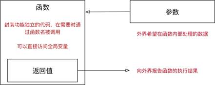

定义函数时，是否接收参数，或者是否返回结果，是根据实际的功能需求来决定的！

a. 如果函数内部处理的数据不确定，就可以将外界的数据以参数传递到函数内部

b. 如果希望一个函数执行完成后，向外界汇报执行结果，就可以增加函数的返回值

1.1 无参数，无返回值

此类函数，不接收参数，也没有返回值，应用场景如下：

a. 只是单纯地做一件事情，例如显示菜单

b. 在函数内部针对全局变量进行操作，例如：新建名片，最终结果记录在全局变量中

注意：

- 如果全局变量的数据类型是一个可变类型，在函数内部可以使用方法修改全局变量的内容 —— 变量的引用不会改变
- 在函数内部，使用赋值语句才会修改变量的引用

1.2 无参数，有返回值

此类函数，不接收参数，但是有返回值，应用场景如下：

- 采集数据，例如温度计，返回结果就是当前的温度，而不需要传递任何的参数

1.3 有参数，无返回值

此类函数，接收参数，没有返回值，应用场景如下：

- 函数内部的代码保持不变，针对不同的参数 处理 不同的数据
- 例如名片管理系统针对找到的名片做修改、删除操作

1.4 有参数，有返回值

此类函数，接收参数，同时有返回值，应用场景如下：

- 函数内部的代码保持不变，针对不同的参数 处理 不同的数据，并且返回期望的处理结果

- 例如名片管理系统使用字典默认值和提示信息提示用户输入内容

- - 如果输入，返回输入内容
  - 如果没有输入，返回字典默认值

#### 2.13.6 函数的递归

##### 2.13.6.1 函数的嵌套调用

- 一个函数里面又调用了另外一个函数，这就是函数嵌套调用

- 如果函数 test2 中，调用了另外一个函数 test1

- - 那么执行到调用 test1 函数时，会先把函数 test1 中的任务都执行完
  - 才会回到 test2 中调用函数 test1 的位置，继续执行后续的代码

函数调用自身的编程技巧称为递归

##### 2.13.6.2 递归函数的特点

特点

- 一个函数内调用自己

- - 函数内部可以调用其他函数，当然在函数内部也可以调用自己

代码特点

1. 函数内部的代码是相同的，只是针对参数不同，处理的结果不同

2. 当参数满足一个条件时，函数不再执行，通常被称为递归的出口，否则会出现死循环！


**提示：**

递归是一个 编程技巧，初次接触递归会感觉有些吃力！在处理不确定的循环条件时，格外的有用，例如：遍历整个文件目录的结构

#### 2.13.7 其他函数

##### 2.13.7.1 print()函数

- 在默认情况下，print 函数输出内容之后，会自动在内容末尾增加换行
- 如果不希望末尾增加换行，可以在 print 函数输出内容的后面增加 , end=""
- 其中 "" 中间可以指定 print 函数输出内容之后，继续希望显示的内容
- 语法格式如下：

```python
# 向控制台输出内容结束之后，不会换行
print("*", end="")
# 单纯的换行 
print("")
```

end="" 表示向控制台输出内容结束之后，不会换行

##### 2.13.7.2 eval()函数

eval()函数十分强大 —— 将字符串当成有效的表达式来求值 并返回计算结果

```python
# 基本的数学计算
In [1]: eval("1 + 1")
Out[1]: 2
# 字符串重复
In [2]: eval("'*' * 10")
Out[2]: '**********'
# 将字符串转换成列表
In [3]: type(eval("[1, 2, 3, 4, 5]"))
Out[3]: list
# 将字符串转换成字典
In [4]: type(eval("{'name': 'xiaoming', 'age': 18}"))
Out[4]: dict
```

案例 - 计算器

**需求**

1. 提示用户输入一个加减乘除混合运算
2. 返回计算结果

```python
input_str = input("请输入一个算术题：")
print(eval(input_str))
```

不要滥用 eval

> 在开发时千万不要使用 `eval` 直接转换 `input` 的结果

```python
__import__('os').system('ls')
```

- 等价代码

```python
import os
os.system("终端命令")
```

- 执行成功，返回 0
- 执行失败，返回错误信息

### 2.14 文件

#### 2.14.1 文件的概念和作用

- 计算机的文件，就是存储在某种长期储存设备上的一段数据
- 长期存储设备包括：硬盘、U 盘、移动硬盘、光盘...

文件的作用：将数据长期保存下来，在需要的时候使用

|                            CPU                             |                             内存                             |                            硬盘                             |
| :--------------------------------------------------------: | :----------------------------------------------------------: | :---------------------------------------------------------: |
|  |  |  |

#### 2.14.2 文件的存储方式

- 在计算机中，文件是以二进制的方式保存在磁盘上的

- 文本文件
  - 可以使用文本编辑软件查看
  - 本质上还是二进制文件
  - 例如：python 的源程序
- 二进制文件
  - 保存的内容 不是给人直接阅读的，而是提供给其他软件使用
  - 例如：图片文件、音频文件、视频文件等等
  - 二进制文件不能使用文本编辑软件查看

#### 2.14.3 文件的基本操作

##### 2.14.3.1 操作文件的套路

在计算机中要操作文件的套路非常固定，一共包含三个步骤：

1. 打开文件
2. 读、写文件
   - **读** 将文件内容读入内存
   - **写** 将内存内容写入文件
3. 关闭文件

##### 2.14.3.2 操作文件的函数/方法

- 在Python中要操作文件需要记住 1 个函数和 3 个方法

| 序号 | 函数/方法 |              说明              |
| :--: | :-------: | :----------------------------: |
|  01  |   open    | 打开文件，并且返回文件操作对象 |
|  02  |   read    |      将文件内容读取到内存      |
|  03  |   write   |       将指定内容写入文件       |
|  04  |   close   |            关闭文件            |

- `open` 函数负责打开文件，并且返回文件对象
- `read`/`write`/`close` 三个方法都需要通过文件对象来调用

1. `read 方法` - 读取文件

- open函数的第一个参数是要打开的文件名（文件名区分大小写）
  - 如果文件存在，返回文件操作对象
  - 如果文件不存在，会抛出异常
- read方法可以一次性读入并返回文件的所有内容

2. `close方法` - 负责关闭文件

- 如果 忘记关闭文件，会造成系统资源消耗，而且会影响到后续对文件的访问

- **注意**：`read` 方法执行后，会把文件指针移动到文件的末尾

```python
# 1. 打开 - 文件名需要注意大小写
file = open("README")
# 2. 读取
text = file.read()
print(text)
# 3. 关闭
file.close()
```

**提示**

- 在开发中，通常会先编写打开和关闭的代码，再编写中间针对文件的读/写操作！

`文件指针`

- 文件指针标记从哪个位置开始读取数据
- 第一次打开文件时，通常文件指针会指向文件的开始位置
- 当执行了read方法后，文件指针会移动到读取内容的末尾
  - 默认情况下会移动到文件末尾

- 第一次读取之后，文件指针移动到了文件末尾，再次调用不会读取到任何的内容

3. 打开文件的方式

- `open` 函数默认以只读方式打开文件，并且返回文件对象

语法如下：

```python
f = open("文件名", "访问方式")
```

| 访问方式 |                             说明                             |
| :------: | :----------------------------------------------------------: |
|    r     | 以**只读**方式打开文件。文件的指针将会放在文件的开头，这是默认模式。如果文件不存在，抛出异常 |
|    w     | 以**只写**方式打开文件。如果文件存在会被覆盖。如果文件不存在，创建新文件 |
|    a     | 以**追加**方式打开文件。如果该文件已存在，文件指针将会放在文件的结尾。如果文件不存在，创建新文件进行写入 |
|    r+    | 以**读写**方式打开文件。文件的指针将会放在文件的开头。如果文件不存在，抛出异常 |
|    w+    | 以**读写**方式打开文件。如果文件存在会被覆盖。如果文件不存在，创建新文件 |
|    a+    | 以**读写**方式打开文件。如果该文件已存在，文件指针将会放在文件的结尾。如果文件不存在，创建新文件进行写入 |

**提示**

- 频繁的移动文件指针，会影响文件的读写效率，开发中更多的时候会以 只读、只写的方式来操作文件

4. 按行读取文件内容

a. `read` 方法

- 默认会把文件的所有内容一次性读取到内存

- 如果文件太大，对内存的占用会非常严重

b. `readline` 方法

- `readline` 方法可以一次读取一行内容
- 方法执行后，会把文件指针移动到下一行，准备再次读取

**读取大文件的正确姿势**

```python
# 打开文件
file = open("README")
while True:
    # 读取一行内容
    text = file.readline()
    # 判断是否读到内容
    if not text:
        break
    # 每读取一行的末尾已经有了一个 `\n`
    print(text, end="")
# 关闭文件
file.close()
```

##### 2.14.3.3 复制文件

1. 小文件复制

- 打开一个已有文件，读取完整内容，并写入到另外一个文件

```python
# 1. 打开文件
file_read = open("README")
file_write = open("README[复件]", "w")
# 2. 读取并写入文件
text = file_read.read()
file_write.write(text)
# 3. 关闭文件
file_read.close()
file_write.close()
```

2. 大文件复制

- 打开一个已有文件，逐行读取内容，并顺序写入到另外一个文件

```python
# 1. 打开文件
file_read = open("README")
file_write = open("README[复件]", "w")

# 2. 读取并写入文件
while True:
    # 每次读取一行
    text = file_read.readline()
    # 判断是否读取到内容
    if not text:
        break
    file_write.write(text)
# 3. 关闭文件
file_read.close()
file_write.close()
```

##### 2.14.3.4 文件/目录的常用管理操作

- 在终端/文件浏览器中可以执行常规的文件/目录管理操作，例如：
  - 创建、重命名、删除、改变路径、查看目录内容、……
- 在Python中，如果希望通过程序实现上述功能，需要导入os模块

1. 文件操作

| 序号 | 方法名 | 说明       | 示例                              |
| :--- | :----- | :--------- | :-------------------------------- |
| 01   | rename | 重命名文件 | `os.rename(源文件名, 目标文件名)` |
| 02   | remove | 删除文件   | `os.remove(文件名)`               |

2. 目录操作

| 序号 | 方法名     | 说明           | 示例                      |
| :--- | :--------- | :------------- | :------------------------ |
| 01   | listdir    | 目录列表       | `os.listdir(目录名)`      |
| 02   | mkdir      | 创建目录       | `os.mkdir(目录名)`        |
| 03   | rmdir      | 删除目录       | `os.rmdir(目录名)`        |
| 04   | getcwd     | 获取当前目录   | `os.getcwd()`             |
| 05   | chdir      | 修改工作目录   | `os.chdir(目标目录)`      |
| 06   | path.isdir | 判断是否是文件 | `os.path.isdir(文件路径)` |

> 提示：文件或者目录操作都支持相对路径和绝对路径

#### 2.14.4 文本文件的编码格式

- 文本文件存储的内容是基于字符编码的文件，常见的编码有 `ASCII` 编码，`UNICODE` 编码等

> Python 2.x 默认使用 `ASCII` 编码格式
> Python 3.x 默认使用 `UTF-8` 编码格式

1. `ASCII` 编码

- 计算机中只有256个ASCII字符
- 一个ASCII在内存中占用1 个字节的空间
  - 8个0/1的排列组合方式一共有256种，也就是2 ** 8

2. `UTF-8` 编码格式

- 计算机中使用1~6 个字节来表示一个UTF-8字符，涵盖了地球上几乎所有地区的文字
- 大多数汉字会使用3 个字节表示
- UTF-8是UNICODE编码的一种编码格式

### 2.15 异常

#### 2.15.1 异常的概念

- 程序在运行时，如果 Python 解释器遇到到一个错误，会停止程序的执行，并且提示一些错误信息，这就是异常
- 程序停止执行并且提示错误信息这个动作，我们通常称之为：抛出(raise)异常

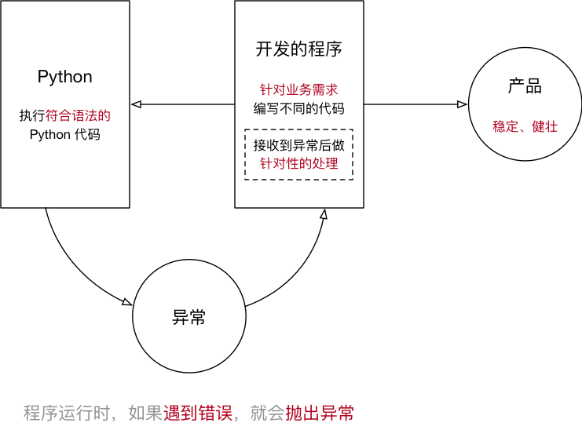

- 程序开发时，很难将 所有的特殊情况都处理的面面俱到，通过异常捕获可以针对突发事件做集中的处理，从而保证程序的稳定性和健壮性

#### 2.15.2 捕获异常

1. 简单的捕获异常语法

- 在程序开发中，如果对某些代码的执行不能确定是否正确，可以增加 try(尝试) 来捕获异常
- 捕获异常最简单的语法格式：

```python
try:
    尝试执行的代码
except:
    出现错误的处理
```

- try尝试，下方编写要尝试代码，不确定是否能够正常执行的代码
- except如果不是，下方编写尝试失败的代码

简单异常捕获演练 —— 要求用户输入整数

```python
try:
    # 提示用户输入一个数字
    num = int(input("请输入数字："))
except:
    print("请输入正确的数字")
```

2. 错误类型捕获

- 在程序执行时，可能会遇到不同类型的异常，并且需要针对不同类型的异常，做出不同的响应，这个时候，就需要捕获错误类型了
- 语法如下：

```python
try:
    # 尝试执行的代码
    pass
except 错误类型1:
    # 针对错误类型1，对应的代码处理
    pass
except (错误类型2, 错误类型3):
    # 针对错误类型2 和 3，对应的代码处理
    pass
except Exception as result:
    print("未知错误 %s" % result)
```

- 当 Python 解释器 抛出异常时，最后一行错误信息的第一个单词，就是错误类型

异常类型捕获演练 —— 要求用户输入整数

**需求**

1. 提示用户输入一个整数
2. 使用 `8` 除以用户输入的整数并且输出

```python
try:
    num = int(input("请输入整数："))
    result = 8 / num
    print(result)
except ValueError:
    print("请输入正确的整数")
except ZeroDivisionError:
    print("除 0 错误")
except Exception as result:
    print("未知错误 %s" % result)
else:
    print("正常执行")
finally:
    print("执行完成，但是不保证正确")
```

捕获未知错误

- 在开发时，要预判到所有可能出现的错误，还是有一定难度的
- 如果希望程序无论出现任何错误，都不会因为 Python 解释器抛出异常而被终止，可以再增加一个except

- else 只有在没有异常时才会执行的代码
- finally 无论是否有异常，都会执行的代码

#### 2.15.3 异常的传递

- 异常的传递 —— 当 函数/方法执行出现异常，会将异常传递给 函数/方法 的调用一方
- 如果传递到主程序，仍然没有异常处理，程序才会被终止

**提示**

- 在开发中，可以在主函数中增加异常捕获
- 而在主函数中调用的其他函数，只要出现异常，都会传递到主函数的异常捕获中
- 这样就不需要在代码中，增加大量的异常捕获，能够保证代码的整洁

**需求**

1. 定义函数 demo1() 提示用户输入一个整数并且返回
2. 定义函数 demo2() 调用 demo1()
3. 在主程序中调用 demo2()

```python
def demo1():
    return int(input("请输入一个整数："))

def demo2():
    return demo1()

try:
    print(demo2())
except ValueError:
    print("请输入正确的整数")
except Exception as result:
    print("未知错误 %s" % result)
```

#### 2.15.4 抛出 `raise` 异常

1. 应用场景

- 在开发中，除了代码执行出错 Python 解释器会抛出异常之外
- 还可以根据应用程序特有的业务需求主动抛出异常

**示例**

- 提示用户输入密码，如果长度少于 8，抛出异常


**注意**

- 当前函数只负责提示用户输入密码，如果密码长度不正确，需要其他的函数进行额外处理
- 因此可以抛出异常，由其他需要处理的函数捕获异常

2. 抛出异常

- Python 中提供了一个 Exception 异常类
- 在开发时，如果满足特定业务需求时，希望抛出异常，可以：
  1. 创建一个 `Exception` 的对象
  2. 使用 `raise` 关键字抛出异常对象

**需求**

- 定义 input_password 函数，提示用户输入密码
- 如果用户输入长度 < 8，抛出异常
- 如果用户输入长度 >=8，返回输入的密码

```python
def input_password():
    # 1. 提示用户输入密码
    pwd = input("请输入密码：")
    # 2. 判断密码长度，如果长度 >= 8，返回用户输入的密码
    if len(pwd) >= 8:
        return pwd
    # 3. 密码长度不够，需要抛出异常
    # 1> 创建异常对象 - 使用异常的错误信息字符串作为参数
    ex = Exception("密码长度不够")
    # 2> 抛出异常对象
    raise ex
try:
    user_pwd = input_password()
    print(user_pwd)
except Exception as result:
    print("发现错误：%s" % result)
```

## 三、面向对象

对象.方法名(参数)

在变量后面输入 .，然后选择针对这个变量要执行的操作，记忆起来比函数要简单很多